# Loop Engineering: Claude Code Sandbox Execution + Self-Correction Loops

## Product Vision

Loop Engineering is **"this conversation as a service"** — an enterprise platform that gives business users (PMs, developers, data teams) the same experience as a Claude Code CLI session, but via a chat UI with sandboxed execution and full SDLC lifecycle visibility.

**The experience today (developer + Claude Code CLI):**

```
Developer: "build shipping calculator API"
Claude Code: asks clarifying questions → proposes approaches → writes spec →
             user reviews → implements in sandbox → tests → self-corrects →
             user approves → PR created
```

**The experience tomorrow (enterprise user + chat UI):**

```
PM: "build shipping calculator API"
Chat Bot: asks clarifying questions → proposes approaches → writes spec →
          user reviews in UI → Claude Code runs in sandbox → tests →
          self-corrects (loop engineering) → user approves in UI → PR created
```

Same workflow. Same quality. But accessible to any enterprise user — not just developers — running safely inside isolated containers with cost governance, HITL checkpoints, and full SDLC dashboard visibility.

**SDLC Lifecycle in the UI:**

```
┌─────────────────────────────────────────────────────────────────┐
│  Task: "Build shipping calculator API"                          │
│                                                                 │
│  ① Estimate  ② Plan  ③ Design  ④ Implement  ⑤ Test  ⑥ Review  │
│     ✅        ✅       🔄        ○            ○        ○        │
│                                                                 │
│  Current phase: Design                                          │
│  Model: claude-opus-4-6 (routed by task type)                   │
│  Iteration: 1/5 | Cost so far: $1.20                           │
│                                                                 │
│  Decision log:                                                  │
│   ✓ Cost estimate approved ($2.50-$7.50 range) — 2:30 PM       │
│   ✓ Plan approved (3 steps) — 2:31 PM                          │
│   ? Design review: awaiting your approval                       │
│                                                                 │
│  Artifacts: 📋 Plan  🏗️ Design spec                            │
│                                                                 │
│  [View Full History] [Intervene] [Cancel]                       │
└─────────────────────────────────────────────────────────────────┘
```

Key capabilities:
- **Decision transparency:** Every question asked, every approval given, every modification requested — logged and visible
- **Artifact access:** Spec, design doc, code changes, test results — all accessible from the UI
- **Progress tracking:** Which SDLC phase is active, iteration count, cost accumulation
- **User intervention:** User can intervene at any checkpoint to change direction, provide guidance, or cancel
- **Model routing:** Different task types (planning, coding, testing, docs) automatically use the optimal model for cost efficiency
- **Voice interaction:** Users can speak tasks and hear responses — multimodal input/output
- **Quick-start cards:** Pre-built use case templates on the home page for instant task launch

### Quick-Start Use Case Cards (Home Page)

The chat UI home page (currently `WelcomeScreen.tsx`) shows clickable use case cards so users can start common tasks with one click. Each card pre-fills the prompt and sets the appropriate execution mode.

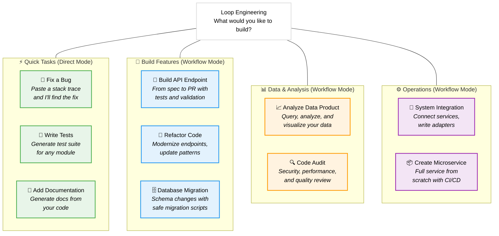
```mermaid
graph TD
    classDef card fill:#FFFFFF,stroke:#E0E0E0,color:#000000,stroke-width:2px
    classDef quick fill:#E8F5E9,stroke:#4CAF50,color:#000000,stroke-width:2px
    classDef workflow fill:#E3F2FD,stroke:#2196F3,color:#000000,stroke-width:2px
    classDef analysis fill:#FFF3E0,stroke:#FF9800,color:#000000,stroke-width:2px
    classDef ops fill:#F3E5F5,stroke:#9C27B0,color:#000000,stroke-width:2px

    TITLE[Loop Engineering<br/>What would you like to build?]:::card

    subgraph QUICK["⚡ Quick Tasks (Direct Mode)"]
        Q1["🐛 Fix a Bug<br/><i>Paste a stack trace<br/>and I'll find the fix</i>"]:::quick
        Q2["🧪 Write Tests<br/><i>Generate test suite<br/>for any module</i>"]:::quick
        Q3["📝 Add Documentation<br/><i>Generate docs from<br/>your code</i>"]:::quick
    end

    subgraph WORKFLOW["🔧 Build Features (Workflow Mode)"]
        W1["🚀 Build API Endpoint<br/><i>From spec to PR with<br/>tests and validation</i>"]:::workflow
        W2["🔄 Refactor Code<br/><i>Modernize endpoints,<br/>update patterns</i>"]:::workflow
        W3["🗄️ Database Migration<br/><i>Schema changes with<br/>safe migration scripts</i>"]:::workflow
    end

    subgraph ANALYSIS["📊 Data & Analysis (Workflow Mode)"]
        A1["📈 Analyze Data Product<br/><i>Query, analyze, and<br/>visualize your data</i>"]:::analysis
        A2["🔍 Code Audit<br/><i>Security, performance,<br/>and quality review</i>"]:::analysis
    end

    subgraph OPS["⚙️ Operations (Workflow Mode)"]
        O1["🔗 System Integration<br/><i>Connect services,<br/>write adapters</i>"]:::ops
        O2["📦 Create Microservice<br/><i>Full service from<br/>scratch with CI/CD</i>"]:::ops
    end

    TITLE --- QUICK
    TITLE --- WORKFLOW
    TITLE --- ANALYSIS
    TITLE --- OPS
```

**Card configuration (backend-driven via config API):**

```yaml
# config/agent/runtime/quickstart.yaml

quickstart_cards:
  - id: "fix-bug"
    title: "Fix a Bug"
    icon: "🐛"
    description: "Paste a stack trace and I'll find the fix"
    category: "quick"
    mode: "direct"
    prompt_template: "Fix this bug. Here's the error:\n\n{user_input}"
    task_type: "bug_fix"
    placeholder: "Paste your stack trace or error message..."

  - id: "write-tests"
    title: "Write Tests"
    icon: "🧪"
    description: "Generate test suite for any module"
    category: "quick"
    mode: "direct"
    prompt_template: "Write comprehensive tests for: {user_input}"
    task_type: "test_writing"
    placeholder: "Enter module path or paste code..."

  - id: "add-docs"
    title: "Add Documentation"
    icon: "📝"
    description: "Generate docs from your code"
    category: "quick"
    mode: "direct"
    prompt_template: "Generate documentation for: {user_input}"
    task_type: "doc_writing"
    placeholder: "Enter module or file path..."

  - id: "build-api"
    title: "Build API Endpoint"
    icon: "🚀"
    description: "From spec to PR with tests and validation"
    category: "build"
    mode: "workflow"
    prompt_template: "Build an API endpoint: {user_input}"
    task_type: "implementation"
    placeholder: "Describe the endpoint or paste a spec..."

  - id: "refactor"
    title: "Refactor Code"
    icon: "🔄"
    description: "Modernize endpoints, update patterns"
    category: "build"
    mode: "workflow"
    prompt_template: "Refactor: {user_input}"
    task_type: "refactor"
    placeholder: "What needs refactoring?"

  - id: "db-migration"
    title: "Database Migration"
    icon: "🗄️"
    description: "Schema changes with safe migration scripts"
    category: "build"
    mode: "workflow"
    prompt_template: "Create a database migration: {user_input}"
    task_type: "implementation"
    placeholder: "Describe the schema change..."

  - id: "analyze-data"
    title: "Analyze Data Product"
    icon: "📈"
    description: "Query, analyze, and visualize your data"
    category: "analysis"
    mode: "workflow"
    prompt_template: "Analyze this data: {user_input}"
    task_type: "planning"
    placeholder: "What data question do you want answered?"

  - id: "code-audit"
    title: "Code Audit"
    icon: "🔍"
    description: "Security, performance, and quality review"
    category: "analysis"
    mode: "workflow"
    prompt_template: "Audit this code for security, performance, and quality: {user_input}"
    task_type: "design"
    placeholder: "Enter repo, module, or file path..."

  - id: "system-integration"
    title: "System Integration"
    icon: "🔗"
    description: "Connect services, write adapters"
    category: "ops"
    mode: "workflow"
    prompt_template: "Create an integration between: {user_input}"
    task_type: "implementation"
    placeholder: "Which systems need connecting?"

  - id: "create-microservice"
    title: "Create Microservice"
    icon: "📦"
    description: "Full service from scratch with CI/CD"
    category: "ops"
    mode: "workflow"
    prompt_template: "Create a new microservice: {user_input}"
    task_type: "implementation"
    placeholder: "Describe the service..."
```

**Frontend component (template-ui):**

```tsx
// src/frontend/components/QuickStartCards.tsx

interface QuickStartCard {
  id: string;
  title: string;
  icon: string;
  description: string;
  category: "quick" | "build" | "analysis" | "ops";
  mode: "direct" | "workflow";
  prompt_template: string;
  task_type: string;
  placeholder: string;
}

// On click:
// 1. If card needs user_input → show input modal with placeholder
// 2. If card is self-contained → directly submit prompt
// 3. Navigate to /chat/:threadId with the pre-filled prompt
// 4. mode and task_type are passed as metadata
```

**User flow:**

```
Home Page → User clicks "🚀 Build API Endpoint"
         → Modal: "Describe the endpoint or paste a spec..."
         → User types: "POST /v1/shipping/calculate — accepts weight 
            and zone, returns price"
         → Navigates to chat with pre-filled prompt
         → Agent starts workflow with mode=workflow, task_type=implementation
```

### Workflows Sidebar & Notification Center (UI)

The template-ui gets two new top-level sections alongside chat: **Workflows** and **Notifications**. Workflows triggered from chat live in their own section with full lifecycle visibility.

**Navigation structure:**

```mermaid
graph LR
    classDef nav fill:#4A90D9,stroke:#2C5F8A,color:#000000
    classDef active fill:#F5A623,stroke:#D4891A,color:#000000
    classDef panel fill:#FFFFFF,stroke:#E0E0E0,color:#000000

    subgraph SIDEBAR["Sidebar Navigation"]
        S1["💬 Chats"]:::nav
        S2["⚙️ Workflows"]:::active
        S3["🔔 Notifications"]:::nav
        S4["⚙️ Settings"]:::nav
    end

    subgraph WORKFLOWS["Workflows Panel"]
        W1["🔄 Running (2)"]:::panel
        W2["  ├── wf-abc123: Build shipping API<br/>     Phase: Implementing (iter 2/5)<br/>     Cost: $3.40 | Started 10m ago"]:::panel
        W3["  └── wf-def456: Refactor endpoints<br/>     Phase: Awaiting approval ⏸️<br/>     Cost: $1.20 | Started 25m ago"]:::panel
        W4[""]:::panel
        W5["✅ Completed (5)"]:::panel
        W6["  ├── wf-ghi789: Write test suite<br/>     3 iterations | $8.50 | 15m ago"]:::panel
        W7["  ├── wf-jkl012: Fix auth bug<br/>     1 iteration | $0.45 | 2h ago"]:::panel
        W8["  └── wf-mno345: DB migration<br/>     2 iterations | $4.20 | yesterday"]:::panel
    end

    S2 --> WORKFLOWS
```

**Workflow detail view (when user clicks a workflow):**

```
┌──────────────────────────────────────────────────────────────────┐
│  ⬅ Back to Workflows                                            │
│                                                                  │
│  ⚙️ wf-abc123: Build shipping calculator API                    │
│  Started by @nsaharan · 10 minutes ago · from Chat #thread-42   │
│                                                                  │
│  ┌────────────────────────────────────────────────────────────┐  │
│  │ ① Estimate  ② Plan  ③ Design  ④ Implement  ⑤ Test  ⑥ Done│  │
│  │    ✅        ✅       ✅        🔄 (2/5)     ○        ○   │  │
│  └────────────────────────────────────────────────────────────┘  │
│                                                                  │
│  📊 Cost: $3.40 / $25.00 max                                    │
│  🤖 Model: claude-opus-4-6 (implementation)                     │
│  🔄 Iteration: 2/5 (first attempt had validation error)         │
│                                                                  │
│  ┌─ Decision Log ────────────────────────────────────────────┐  │
│  │ 10:30 AM  Cost estimate approved ($2.50-$7.50) via UI     │  │
│  │ 10:31 AM  Plan approved (3 steps) via UI                  │  │
│  │ 10:33 AM  Design approved via Slack by @nsaharan          │  │
│  │ 10:35 AM  Iteration 1 failed: validation error            │  │
│  │ 10:38 AM  Iteration 2 in progress...                      │  │
│  └───────────────────────────────────────────────────────────┘  │
│                                                                  │
│  ┌─ Artifacts ───────────────────────────────────────────────┐  │
│  │ 📋 Plan document          📥 View                         │  │
│  │ 🏗️ Design spec            📥 View                         │  │
│  │ 💻 Code diff (iter 1)     📥 View                         │  │
│  │ 🧪 Test results (iter 1)  📥 View  ❌ Failed              │  │
│  │ 💻 Code diff (iter 2)     ⏳ In progress...               │  │
│  └───────────────────────────────────────────────────────────┘  │
│                                                                  │
│  [💬 Open Source Chat] [⏸️ Pause] [❌ Cancel] [💬 Intervene]   │
│                                                                  │
└──────────────────────────────────────────────────────────────────┘
```

**Chat ↔ Workflow linking:**

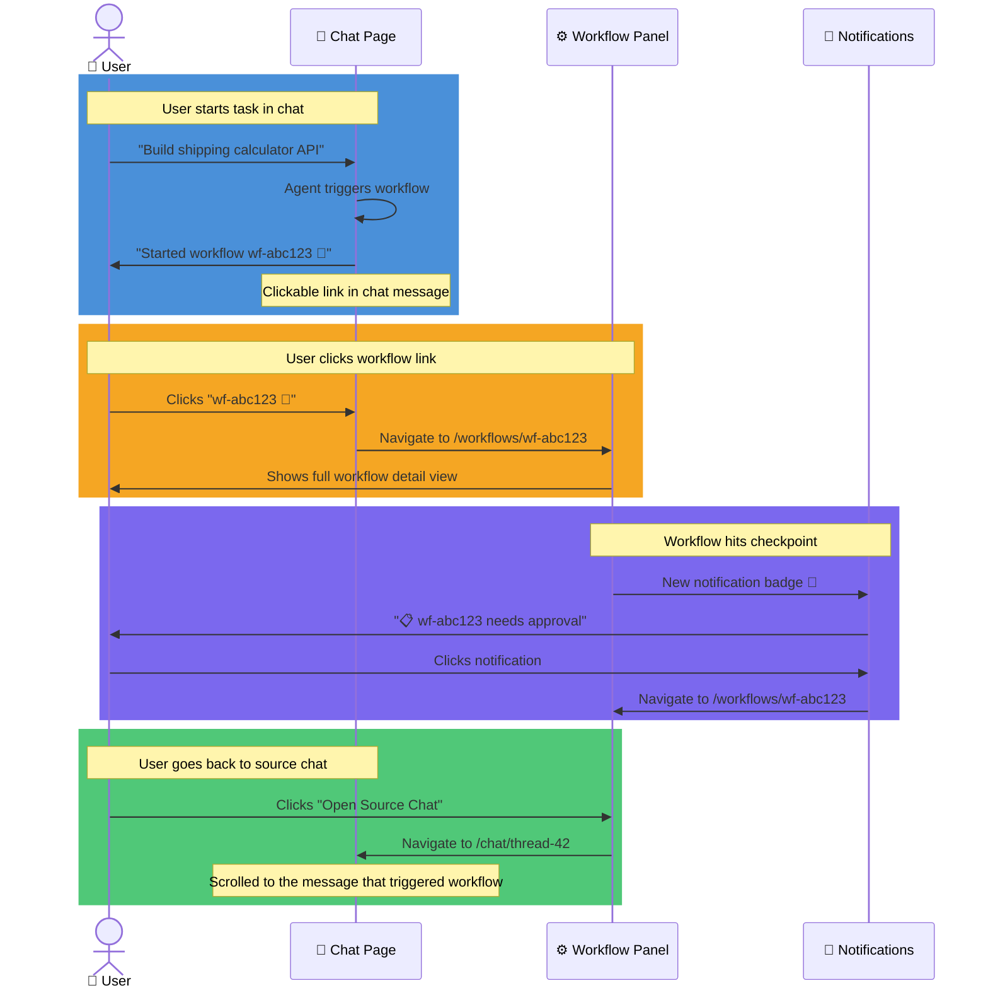
```mermaid
sequenceDiagram
    actor User as 👤 User
    participant Chat as 💬 Chat Page
    participant WF as ⚙️ Workflow Panel
    participant Notif as 🔔 Notifications

    rect rgb(74, 144, 217)
        Note over User,Chat: User starts task in chat
        User->>Chat: "Build shipping calculator API"
        Chat->>Chat: Agent triggers workflow
        Chat->>User: "Started workflow wf-abc123 🔗"
        Note over Chat: Clickable link in chat message
    end

    rect rgb(245, 166, 35)
        Note over User,WF: User clicks workflow link
        User->>Chat: Clicks "wf-abc123 🔗"
        Chat->>WF: Navigate to /workflows/wf-abc123
        WF->>User: Shows full workflow detail view
    end

    rect rgb(123, 104, 238)
        Note over WF,Notif: Workflow hits checkpoint
        WF->>Notif: New notification badge 🔴
        Notif->>User: "📋 wf-abc123 needs approval"
        User->>Notif: Clicks notification
        Notif->>WF: Navigate to /workflows/wf-abc123
    end

    rect rgb(80, 200, 120)
        Note over User,Chat: User goes back to source chat
        User->>WF: Clicks "Open Source Chat"
        WF->>Chat: Navigate to /chat/thread-42
        Note over Chat: Scrolled to the message that triggered workflow
    end
```

**Routes (React Router):**

```tsx
// App.tsx — new routes
<Route path="/" element={<HomePage />} />
<Route path="/chat/:threadId" element={<ChatPage />} />
<Route path="/workflows" element={<WorkflowsListPage />} />        // NEW
<Route path="/workflows/:workflowId" element={<WorkflowDetailPage />} /> // NEW
<Route path="/notifications" element={<NotificationsPage />} />     // NEW
<Route path="/settings" element={<SettingsPage />} />
```

**New components:**

```
src/frontend/
├── pages/
│   ├── WorkflowsListPage.tsx      # List of running + completed workflows
│   ├── WorkflowDetailPage.tsx     # Single workflow detail with SDLC stepper
│   └── NotificationsPage.tsx      # Notification center
├── components/
│   ├── WorkflowCard.tsx           # Card in the list (status, cost, phase)
│   ├── WorkflowStepper.tsx        # Horizontal SDLC phase stepper
│   ├── WorkflowDecisionLog.tsx    # Timeline of decisions and events
│   ├── WorkflowArtifacts.tsx      # List of downloadable/viewable artifacts
│   ├── WorkflowActions.tsx        # Pause/Cancel/Intervene buttons
│   ├── NotificationBadge.tsx      # Badge on sidebar nav (unread count)
│   └── NotificationItem.tsx       # Single notification with link
├── redux/slices/
│   ├── workflows.ts               # Workflow state (list, detail, SSE updates)
│   └── notifications.ts           # Notification state (unread count, list)
└── services/
    └── workflow-api.ts            # GET /workflows, GET /workflows/:id, POST /workflows/:id/action
```

**Notification types:**

| Type | Message | Links to |
|------|---------|----------|
| `checkpoint` | "📋 wf-abc123 needs plan approval" | `/workflows/wf-abc123` |
| `struggle` | "⚠️ wf-abc123 failed 3 times, needs help" | `/workflows/wf-abc123` |
| `completion` | "✅ wf-abc123 complete — PR #42 ready" | `/workflows/wf-abc123` |
| `cost_alert` | "💰 wf-abc123 reached 80% of budget" | `/workflows/wf-abc123` |
| `slack_response` | "💬 @user approved via Slack" | `/workflows/wf-abc123` |

**Notification badge (real-time via SSE):**

```tsx
// NotificationBadge.tsx — shows unread count on sidebar
// Subscribes to workflow_progress SSE events
// Increments on: checkpoint, struggle, completion
// Clears when user visits the notification or workflow
```

**Backend API (template-agent or BFF):**

```yaml
# New endpoints
GET  /api/workflows                    # List all workflows for user
GET  /api/workflows/:id               # Workflow detail (state, decisions, artifacts)
POST /api/workflows/:id/action        # User action (approve, cancel, intervene)
GET  /api/notifications               # List notifications for user
POST /api/notifications/:id/read      # Mark notification as read
```

### Voice Interaction (Phase 4)

Users can **speak** their tasks instead of typing, and **hear** agent responses alongside seeing them in the UI. This makes the platform accessible to non-technical users and enables hands-free operation.

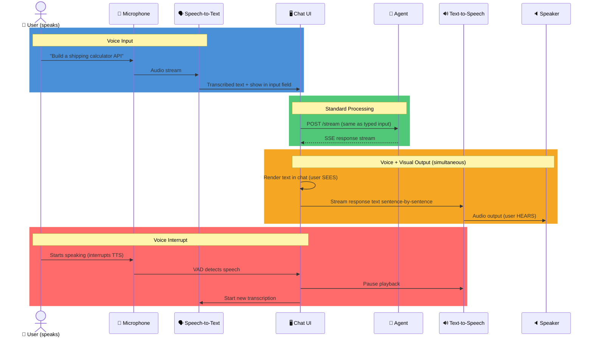
```mermaid
sequenceDiagram
    actor User as 👤 User (speaks)
    participant MIC as 🎤 Microphone
    participant STT as 🗣️ Speech-to-Text
    participant UI as 🖥️ Chat UI
    participant Agent as 🤖 Agent
    participant TTS as 🔊 Text-to-Speech
    participant Speaker as 🔈 Speaker

    rect rgb(74, 144, 217)
        Note over User,STT: Voice Input
        User->>MIC: "Build a shipping calculator API"
        MIC->>STT: Audio stream
        STT->>UI: Transcribed text + show in input field
    end

    rect rgb(80, 200, 120)
        Note over UI,Agent: Standard Processing
        UI->>Agent: POST /stream (same as typed input)
        Agent-->>UI: SSE response stream
    end

    rect rgb(245, 166, 35)
        Note over UI,Speaker: Voice + Visual Output (simultaneous)
        UI->>UI: Render text in chat (user SEES)
        UI->>TTS: Stream response text sentence-by-sentence
        TTS->>Speaker: Audio output (user HEARS)
    end

    rect rgb(255, 107, 107)
        Note over User,UI: Voice Interrupt
        User->>MIC: Starts speaking (interrupts TTS)
        MIC->>UI: VAD detects speech
        UI->>TTS: Pause playback
        UI->>STT: Start new transcription
    end
```

**Implementation approach:**

| Component | Option A (Free, Browser) | Option B (Cloud, High Quality) |
|-----------|-------------------------|-------------------------------|
| **Speech-to-Text** | Web Speech API (`webkitSpeechRecognition`) | Google Cloud STT / OpenAI Whisper API |
| **Text-to-Speech** | `SpeechSynthesis` API | ElevenLabs / Google Cloud TTS / Amazon Polly |
| **Streaming TTS** | Sentence-by-sentence as SSE tokens arrive | Real-time streaming with ElevenLabs WebSocket |
| **VAD (Voice Activity Detection)** | `AudioContext` + volume threshold | `@ricky0123/vad-web` (Silero VAD in browser) |

**Recommendation:** Start with Option A (zero cost, no backend changes), upgrade to Option B for production quality.

**New components (template-ui):**

```
src/frontend/
├── components/
│   ├── VoiceMicButton.tsx         # Microphone toggle on InputForm
│   ├── VoicePlayButton.tsx        # Speaker button on AI messages
│   ├── VoiceWaveform.tsx          # Visual waveform while speaking
│   └── VoiceSettings.tsx          # Settings page: voice on/off, TTS speed, STT language
├── hooks/
│   ├── useSpeechToText.ts         # STT hook — manages recognition lifecycle
│   └── useTextToSpeech.ts         # TTS hook — sentence queuing, interrupt handling
└── redux/slices/
    └── voice.ts                   # isListening, isSpeaking, voiceEnabled, ttsSpeed
```

**VoiceMicButton behavior:**

```tsx
// src/frontend/components/VoiceMicButton.tsx
// Sits next to the submit button in InputForm

// States: idle → listening → processing → idle
// On click: start STT recognition
// On speech end: fill input field with transcript, auto-submit if voiceAutoSubmit=true
// Visual: pulsing red circle while listening, waveform animation

// Accessibility: keyboard shortcut (Ctrl+Shift+V), aria-label, focus management
```

**TTS streaming with SSE tokens:**

```tsx
// src/frontend/hooks/useTextToSpeech.ts

// As SSE tokens arrive, buffer into sentences (split on . ? ! \n)
// Queue each sentence for TTS playback
// On user interrupt (VAD detects speech or user clicks mic):
//   - Pause TTS queue
//   - Clear remaining sentences
//   - Start STT for new input
// On HITL checkpoint: speak the checkpoint message, wait for voice response
```

**HITL checkpoints with voice:**

```
Agent speaks: "Here's my plan. I'll build the schema first, then 
              the endpoint, then tests. Should I proceed?"
              
User speaks:  "Yes, but skip the tests for now"

Agent speaks: "Got it, proceeding without tests."

Agent speaks: "I've finished the implementation. Two out of three 
              tests are passing. One validation test failed. 
              Should I keep trying or do you want to adjust?"

User speaks:  "Keep trying, but check the date format"

Agent speaks: "Noted. Retrying with date format fix."
```

**Voice config (Settings page):**

```yaml
voice:
  enabled: false
  stt_provider: "browser"        # "browser" | "google" | "whisper"
  tts_provider: "browser"        # "browser" | "elevenlabs" | "google"
  tts_voice: "default"           # voice name (provider-specific)
  tts_speed: 1.0                 # 0.5 to 2.0
  auto_submit: true              # auto-send when user stops speaking
  language: "en-US"              # STT language
  vad_sensitivity: 0.5           # voice activity detection threshold
```

## Architecture Diagram

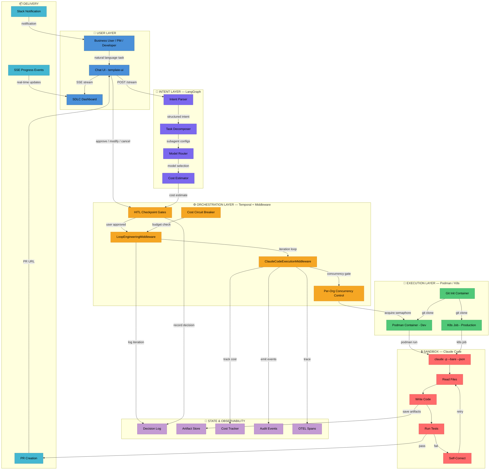
```mermaid
graph TB
    classDef userLayer fill:#4A90D9,stroke:#2C5F8A,color:#000000
    classDef intentLayer fill:#7B68EE,stroke:#5A4BC7,color:#000000
    classDef orchestrationLayer fill:#F5A623,stroke:#D4891A,color:#000000
    classDef executionLayer fill:#50C878,stroke:#3AA05E,color:#000000
    classDef sandboxLayer fill:#FF6B6B,stroke:#D44E4E,color:#000000
    classDef stateLayer fill:#C39BD3,stroke:#9B59B6,color:#000000
    classDef deliveryLayer fill:#45B7D1,stroke:#2E8FAA,color:#000000

    subgraph USER["👤 USER LAYER"]
        U1[Business User / PM / Developer]
        U2[Chat UI - template-ui]
        U3[SDLC Dashboard]
    end

    subgraph INTENT["🧠 INTENT LAYER — LangGraph"]
        I1[Intent Parser]
        I2[Task Decomposer]
        I3[Model Router]
        I4[Cost Estimator]
    end

    subgraph ORCHESTRATION["⚙️ ORCHESTRATION LAYER — Temporal + Middleware"]
        O1[ClaudeCodeExecutionMiddleware]
        O2[LoopEngineeringMiddleware]
        O3[HITL Checkpoint Gates]
        O4[Cost Circuit Breaker]
        O5[Per-Org Concurrency Control]
    end

    subgraph EXECUTION["🐳 EXECUTION LAYER — Podman / K8s"]
        E1[Podman Container - Dev]
        E2[K8s Job - Production]
        E3[Git Init Container]
    end

    subgraph SANDBOX["🔒 SANDBOX — Claude Code"]
        S1["claude -p --bare --json"]
        S2[Read Files]
        S3[Write Code]
        S4[Run Tests]
        S5[Self-Correct]
    end

    subgraph STATE["💾 STATE & OBSERVABILITY"]
        ST1[Decision Log]
        ST2[Artifact Store]
        ST3[Cost Tracker]
        ST4[Audit Events]
        ST5[OTEL Spans]
    end

    subgraph DELIVERY["📦 DELIVERY"]
        D1[PR Creation]
        D2[Slack Notification]
        D3[SSE Progress Events]
    end

    U1 -->|natural language task| U2
    U2 -->|SSE stream| U3
    U2 -->|approve / modify / cancel| O3

    U2 -->|POST /stream| I1
    I1 -->|structured intent| I2
    I2 -->|subagent configs| I3
    I3 -->|model selection| I4
    I4 -->|cost estimate| O3

    O3 -->|user approved| O2
    O2 -->|iteration loop| O1
    O1 -->|concurrency gate| O5
    O5 -->|acquire semaphore| E1
    O4 -->|budget check| O2

    E1 -->|podman run| S1
    E2 -->|k8s job| S1
    E3 -->|git clone| E1
    E3 -->|git clone| E2

    S1 --> S2
    S2 --> S3
    S3 --> S4
    S4 -->|pass| D1
    S4 -->|fail| S5
    S5 -->|retry| S2

    O1 -->|emit events| ST4
    O2 -->|log iteration| ST1
    O3 -->|record decision| ST1
    O1 -->|track cost| ST3
    O1 -->|trace| ST5
    S3 -->|save artifacts| ST2

    D1 -->|PR URL| U2
    D2 -->|notification| U1
    D3 -->|real-time updates| U3

    class U1,U2,U3 userLayer
    class I1,I2,I3,I4 intentLayer
    class O1,O2,O3,O4,O5 orchestrationLayer
    class E1,E2,E3 executionLayer
    class S1,S2,S3,S4,S5 sandboxLayer
    class ST1,ST2,ST3,ST4,ST5 stateLayer
    class D1,D2,D3 deliveryLayer
```

## Workflow: End-to-End Task Lifecycle

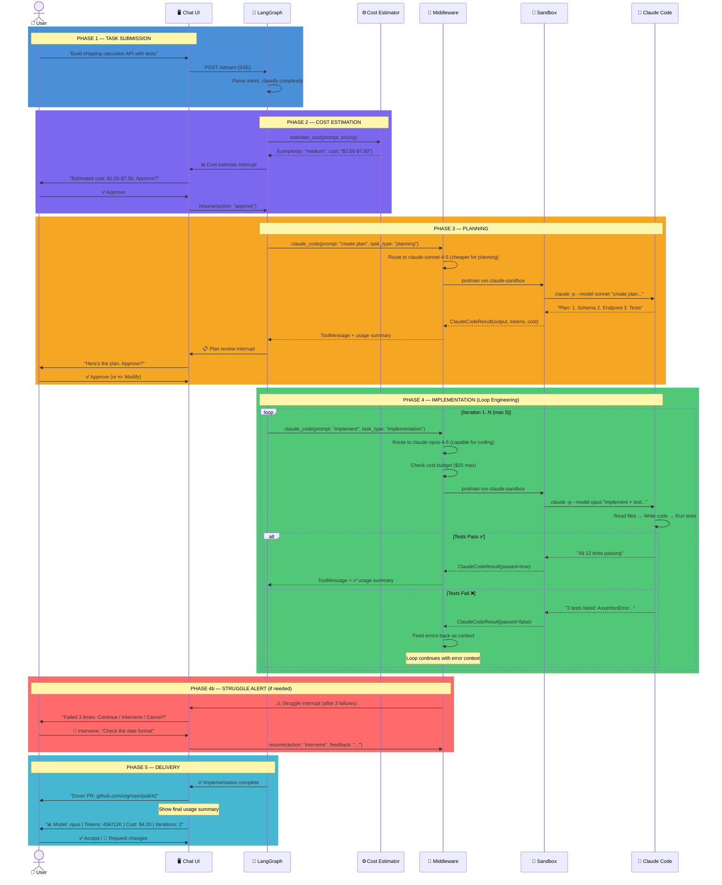
```mermaid
sequenceDiagram
    actor User as 👤 User
    participant UI as 🖥️ Chat UI
    participant LG as 🧠 LangGraph
    participant CE as ⚙️ Cost Estimator
    participant MW as 🔧 Middleware
    participant SB as 🐳 Sandbox
    participant CC as 🤖 Claude Code

    rect rgb(74, 144, 217)
        Note over User,UI: PHASE 1 — TASK SUBMISSION
        User->>UI: "Build shipping calculator API with tests"
        UI->>LG: POST /stream (SSE)
        LG->>LG: Parse intent, classify complexity
    end

    rect rgb(123, 104, 238)
        Note over LG,CE: PHASE 2 — COST ESTIMATION
        LG->>CE: estimate_cost(prompt, pricing)
        CE-->>LG: {complexity: "medium", cost: "$2.50-$7.50"}
        LG->>UI: 📊 Cost estimate interrupt
        UI->>User: "Estimated cost: $2.50-$7.50. Approve?"
        User->>UI: ✅ Approve
        UI->>LG: resume(action: "approve")
    end

    rect rgb(245, 166, 35)
        Note over LG,CC: PHASE 3 — PLANNING
        LG->>MW: claude_code(prompt: "create plan", task_type: "planning")
        MW->>MW: Route to claude-sonnet-4-5 (cheaper for planning)
        MW->>SB: podman run claude-sandbox
        SB->>CC: claude -p --model sonnet "create plan..."
        CC-->>SB: "Plan: 1. Schema 2. Endpoint 3. Tests"
        SB-->>MW: ClaudeCodeResult(output, tokens, cost)
        MW-->>LG: ToolMessage + usage summary
        LG->>UI: 📋 Plan review interrupt
        UI->>User: "Here's the plan. Approve?"
        User->>UI: ✅ Approve (or ✏️ Modify)
    end

    rect rgb(80, 200, 120)
        Note over LG,CC: PHASE 4 — IMPLEMENTATION (Loop Engineering)
        loop Iteration 1..N (max 5)
            LG->>MW: claude_code(prompt: "implement", task_type: "implementation")
            MW->>MW: Route to claude-opus-4-6 (capable for coding)
            MW->>MW: Check cost budget ($25 max)
            MW->>SB: podman run claude-sandbox
            SB->>CC: claude -p --model opus "implement + test..."
            CC->>CC: Read files → Write code → Run tests
            alt Tests Pass ✅
                CC-->>SB: "All 12 tests passing"
                SB-->>MW: ClaudeCodeResult(passed=true)
                MW-->>LG: ToolMessage + ✅ usage summary
            else Tests Fail ❌
                CC-->>SB: "3 tests failed: AssertionError..."
                SB-->>MW: ClaudeCodeResult(passed=false)
                MW->>MW: Feed errors back as context
                Note over MW: Loop continues with error context
            end
        end
    end

    rect rgb(255, 107, 107)
        Note over MW,User: PHASE 4b — STRUGGLE ALERT (if needed)
        MW->>UI: ⚠️ Struggle interrupt (after 3 failures)
        UI->>User: "Failed 3 times. Continue / Intervene / Cancel?"
        User->>UI: 💬 Intervene: "Check the date format"
        UI->>MW: resume(action: "intervene", feedback: "...")
    end

    rect rgb(69, 183, 209)
        Note over LG,User: PHASE 5 — DELIVERY
        LG->>UI: ✅ Implementation complete
        UI->>User: "Done! PR: github.com/org/repo/pull/42"
        Note over UI: Show final usage summary
        UI->>User: "📊 Model: opus | Tokens: 45K/12K | Cost: $4.20 | Iterations: 2"
        User->>UI: ✅ Accept / 📝 Request changes
    end
```

## Loop Engineering: Self-Correction Flow

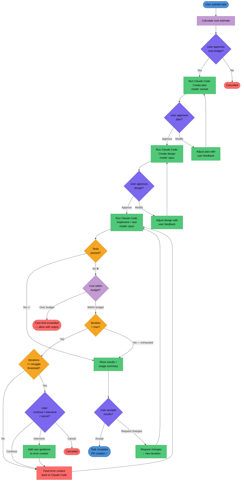
```mermaid
flowchart TD
    classDef startEnd fill:#4A90D9,stroke:#2C5F8A,color:#000000
    classDef process fill:#50C878,stroke:#3AA05E,color:#000000
    classDef decision fill:#F5A623,stroke:#D4891A,color:#000000
    classDef error fill:#FF6B6B,stroke:#D44E4E,color:#000000
    classDef checkpoint fill:#7B68EE,stroke:#5A4BC7,color:#000000
    classDef cost fill:#C39BD3,stroke:#9B59B6,color:#000000

    START([User submits task]):::startEnd
    ESTIMATE[Calculate cost estimate]:::cost
    COST_GATE{User approves<br/>cost budget?}:::checkpoint
    CANCEL1([Cancelled]):::error

    PLAN[Run Claude Code:<br/>Create plan<br/>model: sonnet]:::process
    PLAN_GATE{User approves<br/>plan?}:::checkpoint
    MODIFY_PLAN[Adjust plan with<br/>user feedback]:::process

    DESIGN[Run Claude Code:<br/>Create design<br/>model: opus]:::process
    DESIGN_GATE{User approves<br/>design?}:::checkpoint
    MODIFY_DESIGN[Adjust design with<br/>user feedback]:::process

    IMPLEMENT[Run Claude Code:<br/>Implement + test<br/>model: opus]:::process
    CHECK_TESTS{Tests<br/>passed?}:::decision
    CHECK_COST{Cost within<br/>budget?}:::cost
    COST_EXCEEDED([Cost limit exceeded<br/>— abort with output]):::error
    CHECK_ITER{Iteration<br/>< max?}:::decision
    FEED_ERRORS[Feed error context<br/>back to Claude Code]:::error
    CHECK_STRUGGLE{Iterations<br/>>= struggle<br/>threshold?}:::decision
    STRUGGLE{User:<br/>continue / intervene<br/>/ cancel?}:::checkpoint
    CANCEL2([Cancelled]):::error
    INTERVENE[Add user guidance<br/>to error context]:::process

    DELIVER[Show results +<br/>usage summary]:::process
    ACCEPT_GATE{User accepts<br/>results?}:::checkpoint
    CHANGES[Request changes<br/>→ new iteration]:::process
    DONE([Task complete<br/>PR created ✅]):::startEnd

    START --> ESTIMATE
    ESTIMATE --> COST_GATE
    COST_GATE -->|Yes| PLAN
    COST_GATE -->|No| CANCEL1

    PLAN --> PLAN_GATE
    PLAN_GATE -->|Approve| DESIGN
    PLAN_GATE -->|Modify| MODIFY_PLAN
    MODIFY_PLAN --> PLAN

    DESIGN --> DESIGN_GATE
    DESIGN_GATE -->|Approve| IMPLEMENT
    DESIGN_GATE -->|Modify| MODIFY_DESIGN
    MODIFY_DESIGN --> DESIGN

    IMPLEMENT --> CHECK_TESTS
    CHECK_TESTS -->|Yes ✅| DELIVER
    CHECK_TESTS -->|No ❌| CHECK_COST
    CHECK_COST -->|Over budget| COST_EXCEEDED
    CHECK_COST -->|Within budget| CHECK_ITER
    CHECK_ITER -->|Yes| CHECK_STRUGGLE
    CHECK_ITER -->|No — exhausted| DELIVER
    CHECK_STRUGGLE -->|No| FEED_ERRORS
    CHECK_STRUGGLE -->|Yes| STRUGGLE
    STRUGGLE -->|Continue| FEED_ERRORS
    STRUGGLE -->|Intervene| INTERVENE
    STRUGGLE -->|Cancel| CANCEL2
    INTERVENE --> FEED_ERRORS
    FEED_ERRORS --> IMPLEMENT

    DELIVER --> ACCEPT_GATE
    ACCEPT_GATE -->|Accept| DONE
    ACCEPT_GATE -->|Request changes| CHANGES
    CHANGES --> IMPLEMENT
```

## Model Routing by Task Type

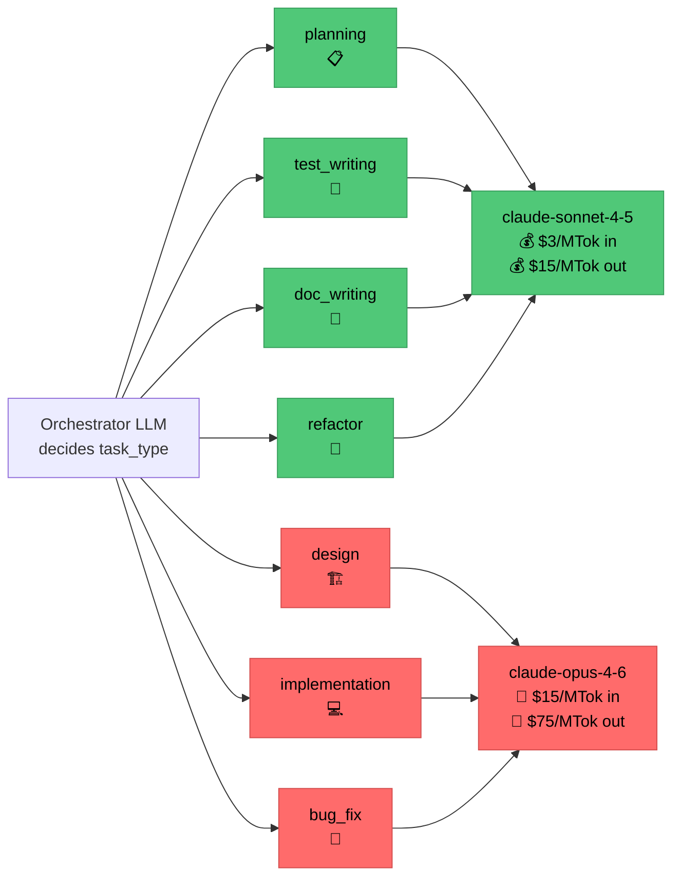
```mermaid
graph LR
    classDef cheap fill:#50C878,stroke:#3AA05E,color:#000000
    classDef expensive fill:#FF6B6B,stroke:#D44E4E,color:#000000
    classDef mid fill:#F5A623,stroke:#D4891A,color:#000000

    TASK[Orchestrator LLM<br/>decides task_type]

    PLAN[planning<br/>📋]:::cheap
    DESIGN[design<br/>🏗️]:::expensive
    IMPL[implementation<br/>💻]:::expensive
    TEST[test_writing<br/>🧪]:::cheap
    DOC[doc_writing<br/>📝]:::cheap
    BUG[bug_fix<br/>🐛]:::expensive
    REFACTOR[refactor<br/>🔄]:::cheap

    SONNET[claude-sonnet-4-5<br/>💰 $3/MTok in<br/>💰 $15/MTok out]:::cheap
    OPUS[claude-opus-4-6<br/>💎 $15/MTok in<br/>💎 $75/MTok out]:::expensive

    TASK --> PLAN
    TASK --> DESIGN
    TASK --> IMPL
    TASK --> TEST
    TASK --> DOC
    TASK --> BUG
    TASK --> REFACTOR

    PLAN --> SONNET
    TEST --> SONNET
    DOC --> SONNET
    REFACTOR --> SONNET

    DESIGN --> OPUS
    IMPL --> OPUS
    BUG --> OPUS
```

## Summary

Add two new middlewares to the template-agent stack that enable **loop engineering** — running Claude Code (or other coding agents) inside sandboxed containers with iterative test-fail-fix self-correction loops and human-in-the-loop checkpoints. This builds on the existing `CodeExecutionMiddleware` / `K8sJobRunner` pattern and integrates with the existing HITL interrupt system and `WorkflowProgressMiddleware` SSE events.

**What this enables:**
- Business users / PMs describe a task in chat → the orchestrator LLM decomposes it into dynamic subagent configs → each subagent runs Claude Code headless (`claude -p`) inside an isolated K8s pod / Podman container → tests run → failures feed back as context for self-correction → results delivered with human approval gates.

**What already exists (no changes needed):**
- Dynamic subagent dispatch via `CodeInterpreterMiddleware` (QuickJS `task()` calls)
- HITL interrupts via LangGraph `interrupt_on` → UI approve/reject buttons
- SSE streaming via `WorkflowProgressMiddleware` → `ExecutionOverlay` in template-ui
- K8s sandbox execution via `K8sJobRunner` (ephemeral pods, seccomp, NetworkPolicy)

**What's new:**
1. `ClaudeCodeExecutionMiddleware` — runs `claude -p` inside sandboxed containers
2. `LoopEngineeringMiddleware` — wraps execution with test→fail→retry loops and checkpoint gates

## Comparison: Dynamic Subagent CodeExecution vs. Claude Code Sandbox

The existing stack has two execution models. This section compares them and explains when to use each.

### Approach A: Existing Dynamic Subagent + CodeExecutionMiddleware

**How it works:** The orchestrator LLM writes JavaScript via `CodeInterpreterMiddleware` (QuickJS) that calls `task()` to dispatch pre-configured subagents. Each subagent is a LangGraph agent with its own model, prompt, and tools. For code execution, `CodeExecutionMiddleware` runs user-generated code snippets (python/shell/node) in ephemeral K8s Jobs.

```
Orchestrator LLM
  └── writes JS: task("analyst", { prompt: "..." })
        └── SubAgent (separate LangGraph agent, pre-configured)
              └── may call execute_code("python", "import pandas...")
                    └── K8sJobRunner → ephemeral pod (runs ONE snippet)
```

**Strengths:**
- Subagents are pre-configured with specific prompts, models, and tool sets
- QuickJS orchestration is fast (in-process, sub-second)
- `execute_code` is lightweight — runs a single code snippet, returns output
- Low cost — subagent uses cheaper models, code execution has no LLM cost

**Weaknesses:**
- Subagents must be pre-defined in `config/agent/subagents/*.md` — not truly dynamic
- `execute_code` runs ONE snippet at a time — cannot do multi-file, multi-step coding
- No agentic coding loop — cannot read project, decide what to change, write code, test, fix
- The orchestrator LLM must write the exact code to execute — it IS the coder
- No self-correction — if the code fails, the orchestrator must figure out the fix itself

### Approach B: Claude Code Sandbox (NEW)

**How it works:** The orchestrator LLM calls the `claude_code` tool with a high-level task description. Claude Code (a full coding agent) runs headless inside an isolated container, autonomously reading files, writing code, running tests, and iterating until done.

```
Orchestrator LLM
  └── calls claude_code(prompt="Build a shipping calculator API with tests")
        └── ClaudeCodeExecutionMiddleware
              └── Podman/K8s container
                    └── claude -p (AUTONOMOUS AGENT)
                          ├── reads project files
                          ├── writes implementation code
                          ├── writes tests
                          ├── runs tests
                          ├── fixes failures (internal loop)
                          └── returns: "Done. 12 tests passing."
```

**Strengths:**
- Truly dynamic — any task, any language, any framework, no pre-configuration
- Full agentic coding — Claude Code autonomously plans, implements, tests, fixes
- Multi-file operations — can scaffold entire features across many files
- Self-correction built-in — Claude Code has its own internal loop + the outer `LoopEngineeringMiddleware` loop
- The orchestrator LLM describes WHAT, not HOW — acts as a PM, not a coder

**Weaknesses:**
- Higher cost — each invocation runs a full Claude Code session ($0.05-$5+ per task)
- Slower — 30 seconds to 5+ minutes per invocation
- Heavier resource footprint — each container needs 500m-2000m CPU, 512Mi-2Gi RAM
- Requires container runtime (Podman/K8s) — more infrastructure than in-process QuickJS

### When to Use Each

| Scenario | Use | Why |
|----------|-----|-----|
| Run a data analysis script | `execute_code` | Single snippet, no file I/O needed |
| Query an API and format results | `execute_code` | Short, self-contained script |
| Dispatch a pre-defined analyst/reviewer | `task()` subagent | Subagent is already configured |
| Build a new feature from a spec | **`claude_code`** | Multi-file, needs planning + testing |
| Fix a bug given a stack trace | **`claude_code`** | Needs to read code, understand context, fix |
| Refactor across multiple files | **`claude_code`** | Agentic coding with file discovery |
| Generate a report from data | `task()` subagent | Structured output, specific model |
| Write and run a migration script | **`claude_code`** | Needs to read schema, write migration, test |
| Quick calculation or data transform | `execute_code` | Lightweight, no LLM cost |

### Verdict

**They are complementary, not competing.** The existing `CodeExecutionMiddleware` + subagents handle structured, lightweight tasks where the orchestrator knows exactly what to do. `ClaudeCodeExecutionMiddleware` handles complex, open-ended coding tasks where an autonomous agent is needed. The orchestrator LLM decides which tool to use based on task complexity — same way a tech lead delegates simple tasks to junior devs (subagents) and complex features to senior engineers (Claude Code).

```
Orchestrator LLM decides:
  │
  ├── Simple data task → task("analyst", ...) → existing subagent
  ├── Quick script → execute_code("python", ...) → existing K8s runner
  └── Complex feature → claude_code("Build...") → NEW sandbox runner
```

## Architecture

```
  User (template-ui)
    │
    ▼ SSE stream (existing)
  BFF Proxy (Fastify, existing)
    │
    ▼ LangGraph stream (existing)
  Aegra / deepagents (template-agent)
    │
    ├── CodeInterpreterMiddleware (existing — QuickJS orchestration)
    │     └── task() dispatches subagents (existing)
    │     └── NEW: can call claude_code() to run coding tasks
    │
    ├── CodeExecutionMiddleware (existing — python/shell/node in K8s)
    │
    ├── LoopEngineeringMiddleware ← NEW (MUST come before ClaudeCode in chain)
    │     ├── Wraps claude_code tool calls with iteration tracking
    │     ├── On test failure: captures errors, re-invokes with error context
    │     ├── Checkpoint gates use LangGraph interrupt() primitive directly
    │     ├── Cost circuit breaker: aborts if cumulative cost exceeds budget
    │     └── Struggle alerts after N failures → HITL interrupt for user guidance
    │
    ├── ClaudeCodeExecutionMiddleware ← NEW
    │     ├── Injects `claude_code` tool into LLM tool list
    │     ├── Routes calls to ClaudeCodeRunner (Podman or K8s)
    │     ├── Per-org concurrency semaphore (same as CodeExecutionMiddleware)
    │     ├── Returns structured JSON from claude -p
    │     ├── Emits audit events via AuditMiddleware pattern
    │     └── Emits workflow_progress events for UI overlay
    │
    ├── HITL (existing — interrupt_on)
    │
    └── WorkflowProgressMiddleware (existing — SSE events)
```

**Middleware ordering is enforced:** `LoopEngineeringMiddleware` MUST appear before `ClaudeCodeExecutionMiddleware` in the chain so that `handler()` calls in the loop middleware pass through to the execution middleware. Startup validation asserts this ordering.

## Well-Architected Framework Compliance

### Operational Excellence
- All Claude Code invocations emit structured audit events via the existing `AuditMiddleware` pattern
- Each loop iteration logged with: iteration number, cost, duration, pass/fail status
- `emit_workflow_progress()` failures are logged (not silently swallowed) and fall back to writing progress into LangGraph state
- Containerfile pins a specific Claude Code CLI version (not `@latest`)

### Security
- Network policy `allow_internet` is removed — only `deny` and `allow_llm_api` are supported
- When `allow_llm_api` is active, egress is restricted to Vertex AI / Anthropic API endpoints only via K8s NetworkPolicy (same pattern as `K8sJobRunner._create_network_policy()`)
- GCP credentials are NEVER mounted when network policy allows any non-LLM egress
- Claude Code runs as non-root (UID 1000), read-only rootfs, all capabilities dropped, seccomp RuntimeDefault
- `--dangerously-skip-permissions` is safe because the container IS the sandbox boundary

### Reliability
- `--max-turns 50` passed to `claude -p` to prevent infinite tool-use loops inside Claude Code
- K8s Jobs set `activeDeadlineSeconds` matching `timeout_seconds` config
- Podman runner uses `asyncio.wait_for()` with hard timeout + process kill on expiry
- Session reuse (`--resume`) capped at `max_session_reuse_iterations` (default 3) — after that, a fresh session is started to avoid context window pollution from accumulated failures
- Pod eviction / OOM handled via resource limits + `restartPolicy: Never` on Jobs

### Performance Efficiency
- Per-org concurrency semaphore prevents resource exhaustion (replicates `CodeExecutionMiddleware._get_semaphore()`)
- Queue timeout: requests waiting beyond `queue_timeout_seconds` are rejected with a clear error
- Workspace uses `emptyDir` by default (fastest); `pvc` available for multi-iteration persistence

### Cost Optimization
- `max_cost_usd_per_loop` hard cap — cumulative cost tracked from `ClaudeCodeResult`, loop aborted if exceeded
- `max_cost_usd_per_invocation` per-call cap — single Claude Code call rejected if cost estimate exceeds threshold
- Cost computed server-side from token counts + model pricing table (not trusting CLI `cost_usd` field)
- Cost emitted as audit events for per-user and per-org tracking

## Configuration

### New config keys in `config/agent/runtime/middleware.yaml`:

```yaml
middleware:
  claude_code:
    enabled: false
    runner: "podman"              # "podman" (local dev) | "k8s" (production)
    image: "claude-sandbox:v2.1.224"  # pinned version, not :latest
    timeout_seconds: 300
    max_turns: 50                 # passed to claude -p --max-turns
    max_output_bytes: 2_097_152   # 2MB
    streaming_enabled: true
    max_concurrent_per_org: 3
    queue_timeout_seconds: 30.0

    # Auth — exactly one must be set
    auth:
      type: "vertex"              # "vertex" | "api_key" | "oauth"
      vertex_project_id: ""       # from ANTHROPIC_VERTEX_PROJECT_ID env var

    # Container resources
    resource_requests:
      cpu: "500m"
      memory: "512Mi"
    resource_limits:
      cpu: "2000m"
      memory: "2Gi"

    # Sandbox security (K8s mode)
    security:
      read_only_rootfs: true
      run_as_non_root: true
      run_as_user: 1000
      drop_capabilities: ["ALL"]
      seccomp_profile: "RuntimeDefault"
      network_policy: "allow_llm_api"   # "deny" | "allow_llm_api" (no allow_internet)

    # Workspace
    workspace:
      volume_type: "emptyDir"     # "emptyDir" | "pvc"
      size_limit: "1Gi"
      mount_path: "/workspace"
      # Git integration (optional)
      git:
        clone_url: ""             # if set, init-container clones this repo
        branch: ""                # branch to checkout
        extract_diff_on_complete: true  # capture git diff after execution

    # Cost governance
    cost:
      max_cost_usd_per_invocation: 5.0
      max_cost_usd_per_loop: 25.0
      pricing:                    # token → USD conversion
        claude-opus-4-6:
          input_per_1k: 0.015
          output_per_1k: 0.075
        claude-sonnet-4-5:
          input_per_1k: 0.003
          output_per_1k: 0.015

  loop_engineering:
    enabled: false
    max_iterations: 5
    checkpoints:
      plan_review: true           # pause after planning, ask user to approve
      design_review: true         # pause after design, ask user to review
      pre_implement: false        # pause before implementation starts
      on_struggle: true           # pause after N consecutive failures
    struggle_threshold: 3         # trigger struggle alert after this many failures
    error_context_max_chars: 2000 # max chars of error output to feed back
    max_session_reuse_iterations: 3  # start fresh session after this many --resume calls
```

### Pydantic config models:

```python
# deep_agent/src/claude_code/config.py

class ClaudeCodeAuthConfig(BaseModel):
    type: Literal["vertex", "api_key", "oauth"] = "vertex"
    vertex_project_id: str = ""

class ClaudeCodeSecurityConfig(BaseModel):
    read_only_rootfs: bool = True
    run_as_non_root: bool = True
    run_as_user: int = 1000
    drop_capabilities: list[str] = Field(default_factory=lambda: ["ALL"])
    seccomp_profile: str = "RuntimeDefault"
    network_policy: Literal["deny", "allow_llm_api"] = "allow_llm_api"

class ClaudeCodeGitConfig(BaseModel):
    clone_url: str = ""
    branch: str = ""
    extract_diff_on_complete: bool = True

class ClaudeCodeWorkspaceConfig(BaseModel):
    volume_type: Literal["emptyDir", "pvc"] = "emptyDir"
    size_limit: str = "1Gi"
    mount_path: str = "/workspace"
    git: ClaudeCodeGitConfig = Field(default_factory=ClaudeCodeGitConfig)

class ClaudeCodeCostConfig(BaseModel):
    max_cost_usd_per_invocation: float = Field(default=5.0, ge=0.1, le=100.0)
    max_cost_usd_per_loop: float = Field(default=25.0, ge=1.0, le=500.0)
    pricing: dict[str, dict[str, float]] = Field(default_factory=lambda: {
        "claude-opus-4-6": {"input_per_1k": 0.015, "output_per_1k": 0.075},
        "claude-sonnet-4-5": {"input_per_1k": 0.003, "output_per_1k": 0.015},
    })

class ClaudeCodeConfig(BaseModel):
    enabled: bool = False
    runner: Literal["podman", "k8s"] = "podman"
    image: str = "claude-sandbox:v2.1.224"
    timeout_seconds: int = Field(default=300, ge=30, le=1800)
    max_turns: int = Field(default=50, ge=5, le=200)
    max_output_bytes: int = Field(default=2_097_152)
    streaming_enabled: bool = True
    max_concurrent_per_org: int = Field(default=3, ge=1, le=20)
    queue_timeout_seconds: float = Field(default=30.0, ge=1.0, le=120.0)
    auth: ClaudeCodeAuthConfig = Field(default_factory=ClaudeCodeAuthConfig)
    resource_requests: dict[str, str] = Field(
        default_factory=lambda: {"cpu": "500m", "memory": "512Mi"}
    )
    resource_limits: dict[str, str] = Field(
        default_factory=lambda: {"cpu": "2000m", "memory": "2Gi"}
    )
    security: ClaudeCodeSecurityConfig = Field(default_factory=ClaudeCodeSecurityConfig)
    workspace: ClaudeCodeWorkspaceConfig = Field(default_factory=ClaudeCodeWorkspaceConfig)
    cost: ClaudeCodeCostConfig = Field(default_factory=ClaudeCodeCostConfig)

class LoopEngineeringConfig(BaseModel):
    enabled: bool = False
    max_iterations: int = Field(default=5, ge=1, le=20)
    checkpoints: dict[str, bool] = Field(
        default_factory=lambda: {
            "plan_review": True,
            "design_review": True,
            "pre_implement": False,
            "on_struggle": True,
        }
    )
    struggle_threshold: int = Field(default=3, ge=1, le=10)
    error_context_max_chars: int = Field(default=2000, ge=200, le=10000)
    max_session_reuse_iterations: int = Field(default=3, ge=1, le=10)
```

## Component Design

### 1. ClaudeCodeResult and Test Result Detection

Test pass/fail is determined by a **three-signal contract**, not string matching:

```python
# deep_agent/src/claude_code/runner.py

@dataclass
class TestResult:
    passed: bool
    signal: str           # "exit_code" | "json_field" | "output_pattern"
    details: str          # human-readable summary

@dataclass
class ClaudeCodeResult:
    output: str
    session_id: str
    exit_code: int
    is_error: bool
    duration_seconds: float
    raw_json: dict
    # Token-level usage for server-side cost calculation
    input_tokens: int
    output_tokens: int
    cache_read_tokens: int
    cache_creation_tokens: int
    model: str

    @property
    def test_result(self) -> TestResult:
        """Determine test pass/fail via three signals (priority order)."""
        # Signal 1: Claude Code's own is_error field
        if self.is_error:
            return TestResult(False, "json_field", "Claude Code reported an error")

        # Signal 2: Exit code from the process
        if self.exit_code != 0:
            return TestResult(False, "exit_code", f"Exit code {self.exit_code}")

        # Signal 3: Structured output — look for test framework markers
        lower = self.output.lower()
        fail_markers = ["failed", "failure", "error", "traceback", "assert"]
        pass_markers = ["passed", "tests pass", "all tests", "ok"]

        has_fail = any(m in lower for m in fail_markers)
        has_pass = any(m in lower for m in pass_markers)

        if has_pass and not has_fail:
            return TestResult(True, "output_pattern", "Test markers indicate pass")
        if has_fail:
            return TestResult(False, "output_pattern", "Test markers indicate failure")

        # No clear signal — assume passed (Claude Code completed without error)
        return TestResult(True, "exit_code", "No error signals detected")

    def compute_cost(self, pricing: dict[str, dict[str, float]]) -> float:
        """Server-side cost calculation from token counts + pricing table."""
        model_pricing = pricing.get(self.model, {})
        input_cost = (self.input_tokens / 1000) * model_pricing.get("input_per_1k", 0.015)
        output_cost = (self.output_tokens / 1000) * model_pricing.get("output_per_1k", 0.075)
        return input_cost + output_cost
```

### 2. ClaudeCodeRunner (execution backend)

Two implementations behind a common interface, following `K8sJobRunner` pattern:

```python
# deep_agent/src/claude_code/runner.py

class BaseClaudeCodeRunner(ABC):
    def __init__(self, config: ClaudeCodeConfig):
        self._config = config

    @abstractmethod
    async def execute(self, prompt: str, workspace_path: str,
                      allowed_tools: list[str] | None = None,
                      session_id: str | None = None) -> ClaudeCodeResult: ...

    def _build_base_args(self, prompt, allowed_tools, session_id) -> list[str]:
        args = [
            "-p", "--output-format", "json", "--bare",
            "--dangerously-skip-permissions",
            "--max-turns", str(self._config.max_turns),
        ]
        if allowed_tools:
            args.extend(["--allowedTools", ",".join(allowed_tools)])
        if session_id:
            args.extend(["--resume", session_id])
        args.append(prompt)
        return args


class PodmanClaudeCodeRunner(BaseClaudeCodeRunner):
    """Local dev: runs claude -p in a Podman container via subprocess."""

    async def execute(self, prompt, workspace_path, allowed_tools=None,
                      session_id=None) -> ClaudeCodeResult:
        cmd = ["podman", "run", "--rm"]
        cmd.extend(self._build_env_args())
        cmd.extend(["-v", f"{workspace_path}:/workspace"])
        cmd.append(self._config.image)
        cmd.extend(self._build_base_args(prompt, allowed_tools, session_id))

        proc = await asyncio.create_subprocess_exec(
            *cmd, stdout=asyncio.subprocess.PIPE, stderr=asyncio.subprocess.PIPE
        )
        try:
            stdout, stderr = await asyncio.wait_for(
                proc.communicate(), timeout=self._config.timeout_seconds
            )
        except asyncio.TimeoutError:
            proc.kill()
            await proc.wait()
            return ClaudeCodeResult(
                output="Execution timed out", session_id="", exit_code=-1,
                is_error=True, duration_seconds=self._config.timeout_seconds,
                raw_json={}, input_tokens=0, output_tokens=0,
                cache_read_tokens=0, cache_creation_tokens=0, model="unknown",
            )
        return self._parse_result(stdout, stderr, proc.returncode)


class K8sClaudeCodeRunner(BaseClaudeCodeRunner):
    """Production: runs claude -p in an ephemeral K8s Job."""

    def build_job_manifest(self, prompt, workspace_path, allowed_tools,
                           session_id, org_id, run_id) -> dict:
        """Build K8s Job spec — mirrors K8sJobRunner.build_job_manifest()."""
        job_name = f"claude-{run_id[:8]}"
        return {
            "apiVersion": "batch/v1",
            "kind": "Job",
            "metadata": {
                "name": job_name,
                "labels": {"app": "claude-code", "org": org_id},
            },
            "spec": {
                "activeDeadlineSeconds": self._config.timeout_seconds,
                "ttlSecondsAfterFinished": 30,
                "backoffLimit": 0,
                "template": {
                    "spec": {
                        "restartPolicy": "Never",
                        # Init container for git clone (if configured)
                        "initContainers": self._build_init_containers(),
                        "containers": [{
                            "name": "claude",
                            "image": self._config.image,
                            "args": self._build_base_args(
                                prompt, allowed_tools, session_id
                            ),
                            "env": self._build_env_vars(),
                            "resources": {
                                "requests": self._config.resource_requests,
                                "limits": self._config.resource_limits,
                            },
                            "securityContext": {
                                "readOnlyRootFilesystem": True,
                                "runAsNonRoot": True,
                                "runAsUser": self._config.security.run_as_user,
                                "capabilities": {"drop": ["ALL"]},
                            },
                            "volumeMounts": [
                                {"name": "workspace", "mountPath": "/workspace"},
                                {"name": "tmp", "mountPath": "/tmp"},
                                {"name": "gcp-creds", "mountPath": "/gcp",
                                 "readOnly": True},
                            ],
                        }],
                        "volumes": [
                            {"name": "workspace", "emptyDir": {
                                "sizeLimit": self._config.workspace.size_limit}},
                            {"name": "tmp", "emptyDir": {"sizeLimit": "64Mi"}},
                            {"name": "gcp-creds", "secret": {
                                "secretName": "gcp-adc-credentials"}},
                        ],
                    },
                },
            },
        }

    def _build_init_containers(self) -> list[dict]:
        """Optional git clone init container."""
        git = self._config.workspace.git
        if not git.clone_url:
            return []
        branch_args = ["--branch", git.branch] if git.branch else []
        return [{
            "name": "git-clone",
            "image": "alpine/git:latest",
            "command": ["git", "clone", "--depth", "1", *branch_args,
                        git.clone_url, "/workspace"],
            "volumeMounts": [{"name": "workspace", "mountPath": "/workspace"}],
            "securityContext": {"runAsNonRoot": True, "runAsUser": 1000},
        }]
```

### 3. ClaudeCodeExecutionMiddleware

Follows `CodeExecutionMiddleware` pattern with per-org concurrency and audit events:

```python
# deep_agent/src/claude_code/middleware.py

class ClaudeCodeExecutionMiddleware(AgentMiddleware):
    """Inject claude_code tool and route calls to sandbox runner."""

    def __init__(self, *, config: ClaudeCodeConfig):
        self._config = config
        self._runner = (PodmanClaudeCodeRunner(config) if config.runner == "podman"
                        else K8sClaudeCodeRunner(config))
        self._claude_code_tool = _build_claude_code_tool()
        self._semaphores: dict[str, asyncio.Semaphore] = {}

    def _get_semaphore(self, org: str) -> asyncio.Semaphore:
        if org not in self._semaphores:
            self._semaphores[org] = asyncio.Semaphore(
                self._config.max_concurrent_per_org
            )
        return self._semaphores[org]

    async def awrap_model_call(self, request, handler):
        request.tools = [*request.tools, self._claude_code_tool]
        return await handler(request)

    async def awrap_tool_call(self, request, handler):
        if request.tool_call.name != "claude_code":
            return await handler(request)

        args = request.tool_call.args
        org = _extract_org(request)
        sem = self._get_semaphore(org)

        # Concurrency gate with queue timeout
        try:
            acquired = await asyncio.wait_for(
                sem.acquire(), timeout=self._config.queue_timeout_seconds
            )
        except asyncio.TimeoutError:
            return ToolMessage(
                content="Claude Code execution queue full. Try again later.",
                tool_call_id=request.tool_call.id,
            )

        try:
            task_name = args.get("task_name", "claude-code")
            emit_workflow_progress("subagent_start", {
                "step_index": 0, "subagent": task_name, "status": "running",
            })

            result = await self._runner.execute(
                prompt=args["prompt"],
                workspace_path=args.get("workspace", "/workspace"),
                allowed_tools=args.get("allowed_tools"),
                session_id=args.get("session_id"),
            )

            # Emit audit event
            _emit_audit_event("claude_code_execution", {
                "task_name": task_name,
                "input_tokens": result.input_tokens,
                "output_tokens": result.output_tokens,
                "model": result.model,
                "cost_usd": result.compute_cost(self._config.cost.pricing),
                "duration_seconds": result.duration_seconds,
                "is_error": result.is_error,
            })

            emit_workflow_progress("subagent_end", {
                "step_index": 0, "subagent": task_name,
                "status": "complete" if not result.is_error else "failed",
                "duration_ms": int(result.duration_seconds * 1000),
            })

            # Return result with metadata for LoopEngineeringMiddleware
            msg = ToolMessage(
                content=result.output,
                tool_call_id=request.tool_call.id,
            )
            msg.additional_kwargs["claude_code_result"] = asdict(result)
            return msg

        finally:
            sem.release()
```

### 4. LoopEngineeringMiddleware

Uses **LangGraph `interrupt()` directly** for checkpoint gates (not `emit_workflow_progress` which is fire-and-forget):

```python
# deep_agent/src/claude_code/loop_middleware.py

from langgraph.types import interrupt

class LoopEngineeringMiddleware(AgentMiddleware):
    """Test-fail-fix loops and checkpoint gates for claude_code calls."""

    def __init__(self, *, config: LoopEngineeringConfig,
                 cost_config: ClaudeCodeCostConfig):
        self._config = config
        self._cost_config = cost_config

    async def awrap_tool_call(self, request, handler):
        if request.tool_call.name != "claude_code":
            return await handler(request)

        args = request.tool_call.args
        prompt = args["prompt"]

        # ── Checkpoint: plan_review ──
        if self._config.checkpoints.get("plan_review"):
            plan_args = {**args, "prompt": (
                f"Analyze this task and create a numbered plan. "
                f"Do NOT implement yet.\n\n{prompt}"
            )}
            plan_request = self._clone_request(request, args=plan_args)
            plan_result = await handler(plan_request)

            # LangGraph interrupt() — blocks execution, UI shows approve/reject
            user_decision = interrupt({
                "type": "plan_review",
                "message": plan_result.content,
                "actions": ["approve", "modify", "cancel"],
            })

            if user_decision.get("action") == "cancel":
                return ToolMessage(
                    content="Workflow cancelled by user at plan review.",
                    tool_call_id=request.tool_call.id,
                )
            if user_decision.get("action") == "modify":
                prompt += f"\n\nUSER FEEDBACK: {user_decision.get('feedback', '')}"

        # ── Self-correction loop with cost governance ──
        error_context = ""
        session_id = args.get("session_id")
        cumulative_cost = 0.0

        for iteration in range(1, self._config.max_iterations + 1):
            # Session reuse cap — start fresh after N resumes
            if iteration > self._config.max_session_reuse_iterations:
                session_id = None

            full_prompt = f"{prompt}{error_context}" if not session_id else error_context or prompt
            iter_args = {**args, "prompt": full_prompt, "session_id": session_id}
            iter_request = self._clone_request(request, args=iter_args)

            result = await handler(iter_request)

            # Extract ClaudeCodeResult metadata
            cc_result = result.additional_kwargs.get("claude_code_result", {})
            session_id = cc_result.get("session_id")
            iteration_cost = self._compute_cost(cc_result)
            cumulative_cost += iteration_cost

            # Cost circuit breaker
            if cumulative_cost > self._cost_config.max_cost_usd_per_loop:
                _emit_audit_event("loop_cost_exceeded", {
                    "cumulative_cost": cumulative_cost,
                    "limit": self._cost_config.max_cost_usd_per_loop,
                    "iteration": iteration,
                })
                emit_workflow_progress("loop_iteration", {
                    "iteration": iteration, "status": "cost_exceeded",
                    "cumulative_cost_usd": cumulative_cost,
                })
                return ToolMessage(
                    content=(f"Loop aborted: cost limit exceeded "
                             f"(${cumulative_cost:.2f} > ${self._cost_config.max_cost_usd_per_loop}). "
                             f"Last output:\n{result.content}"),
                    tool_call_id=request.tool_call.id,
                )

            # Test result detection (three-signal contract)
            test_passed = cc_result.get("exit_code", 0) == 0 and not cc_result.get("is_error", False)
            # Refine with output pattern analysis
            test_result = ClaudeCodeResult(**cc_result).test_result if cc_result else TestResult(True, "default", "")

            emit_workflow_progress("loop_iteration", {
                "iteration": iteration,
                "max_iterations": self._config.max_iterations,
                "status": "passed" if test_result.passed else "failed",
                "signal": test_result.signal,
                "cost_usd": iteration_cost,
                "cumulative_cost_usd": cumulative_cost,
            })

            _emit_audit_event("loop_iteration", {
                "iteration": iteration,
                "passed": test_result.passed,
                "signal": test_result.signal,
                "cost_usd": iteration_cost,
                "cumulative_cost_usd": cumulative_cost,
            })

            if test_result.passed:
                return result

            # Tests failed — build error context for next iteration
            error_context = (
                f"\n\nPREVIOUS ATTEMPT {iteration} FAILED "
                f"(signal: {test_result.signal}):\n"
                f"{result.content[-self._config.error_context_max_chars:]}\n\n"
                f"Fix the issues. Read existing files first."
            )

            # Struggle alert — LangGraph interrupt (blocking)
            if (iteration >= self._config.struggle_threshold
                    and self._config.checkpoints.get("on_struggle")):
                user_decision = interrupt({
                    "type": "struggle_alert",
                    "iteration": iteration,
                    "max_iterations": self._config.max_iterations,
                    "cumulative_cost_usd": cumulative_cost,
                    "last_error": result.content[-500:],
                    "actions": ["continue", "intervene", "cancel"],
                })

                if user_decision.get("action") == "cancel":
                    return ToolMessage(
                        content="Loop cancelled by user.",
                        tool_call_id=request.tool_call.id,
                    )
                if user_decision.get("action") == "intervene":
                    error_context += f"\nUSER GUIDANCE: {user_decision.get('feedback', '')}"

        return result  # return last attempt

    def _compute_cost(self, cc_result: dict) -> float:
        input_t = cc_result.get("input_tokens", 0)
        output_t = cc_result.get("output_tokens", 0)
        model = cc_result.get("model", "claude-opus-4-6")
        pricing = self._cost_config.pricing.get(model, {})
        return ((input_t / 1000) * pricing.get("input_per_1k", 0.015) +
                (output_t / 1000) * pricing.get("output_per_1k", 0.075))
```

### 5. Integration with Existing Middleware Stack

Register in `MiddlewareDefaults` (existing file `deep_agent/src/agent/config/middleware.py`):

```python
class MiddlewareDefaults(BaseModel):
    # ... existing fields ...
    code_execution: CodeExecutionConfig = Field(default_factory=CodeExecutionConfig)
    claude_code: ClaudeCodeConfig = Field(default_factory=ClaudeCodeConfig)
    loop_engineering: LoopEngineeringConfig = Field(default_factory=LoopEngineeringConfig)
```

Register builder in `build_middleware_list()` with **ordering validation**:

```python
def build_middleware_list(config, ...):
    middlewares = []
    # ... existing middleware builders ...

    # ORDERING: LoopEngineering MUST come before ClaudeCode
    if config.loop_engineering.enabled:
        if not config.claude_code.enabled:
            logger.warning("loop_engineering requires claude_code — disabling loop_engineering")
        else:
            mw = _build_loop_engineering_middleware(
                config.loop_engineering, config.claude_code.cost
            )
            if mw:
                middlewares.append(mw)

    if config.claude_code.enabled:
        mw = _build_claude_code_middleware(config.claude_code)
        if mw:
            middlewares.append(mw)

    return middlewares
```

## Workspace Lifecycle

### Git Integration (optional, via init-container)

When `workspace.git.clone_url` is configured:

```
┌──────────────────────────────────────────────────────────────┐
│ K8s Job                                                      │
│                                                              │
│  Init Container (alpine/git):                                │
│    git clone --depth 1 --branch <branch> <url> /workspace    │
│                                                              │
│  Main Container (claude-sandbox):                            │
│    claude -p "implement the feature..." /workspace           │
│                                                              │
│  Post-execution (via runner):                                │
│    1. Stream logs for ClaudeCodeResult                       │
│    2. If extract_diff_on_complete: run git diff in workspace │
│    3. Capture diff as artifact in ClaudeCodeResult           │
│    4. Cleanup: delete Job + NetworkPolicy                    │
└──────────────────────────────────────────────────────────────┘
```

For workspace persistence across loop iterations: use `volume_type: pvc` so the workspace survives pod restarts within the same loop.

### Agent Context Injection (CLAUDE.md, Memory, Preferences)

Claude Code running in the sandbox needs project context and user preferences to produce quality output. Without these, it starts from a blank slate every time — missing conventions, styles, and past decisions.

**What gets injected into the workspace:**

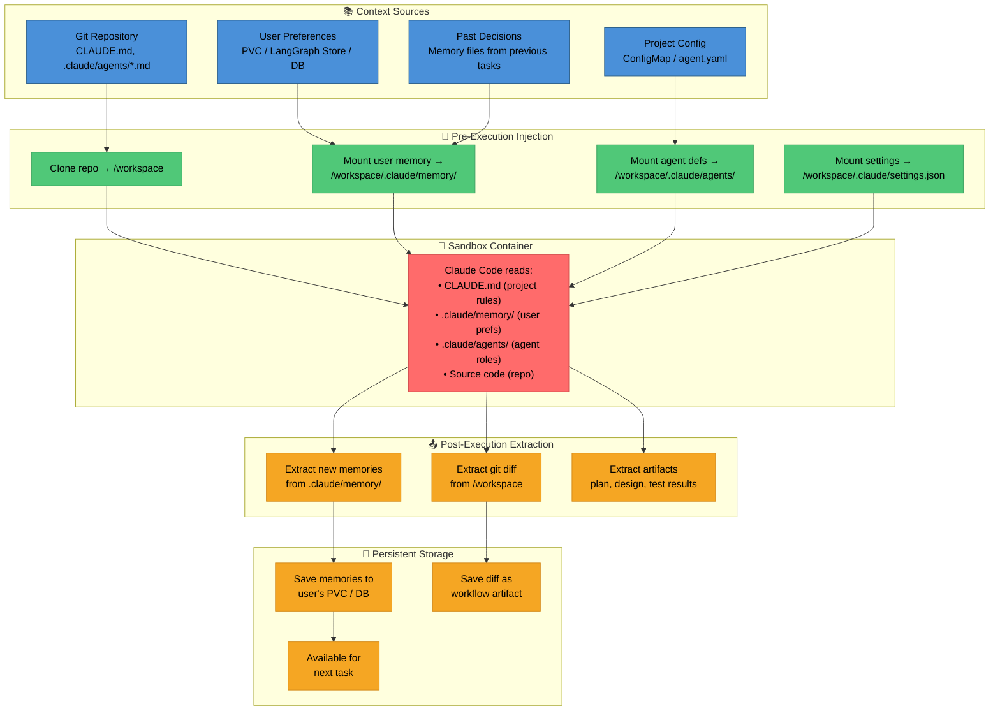
```mermaid
graph TB
    classDef source fill:#4A90D9,stroke:#2C5F8A,color:#000000
    classDef inject fill:#50C878,stroke:#3AA05E,color:#000000
    classDef sandbox fill:#FF6B6B,stroke:#D44E4E,color:#000000
    classDef persist fill:#F5A623,stroke:#D4891A,color:#000000

    subgraph SOURCES["📚 Context Sources"]
        S1[Git Repository<br/>CLAUDE.md, .claude/agents/*.md]:::source
        S2[User Preferences<br/>PVC / LangGraph Store / DB]:::source
        S3[Project Config<br/>ConfigMap / agent.yaml]:::source
        S4[Past Decisions<br/>Memory files from previous tasks]:::source
    end

    subgraph INJECTION["💉 Pre-Execution Injection"]
        I1[Clone repo → /workspace]:::inject
        I2[Mount user memory →<br/>/workspace/.claude/memory/]:::inject
        I3[Mount agent defs →<br/>/workspace/.claude/agents/]:::inject
        I4[Mount settings →<br/>/workspace/.claude/settings.json]:::inject
    end

    subgraph SANDBOX["🐳 Sandbox Container"]
        C1["Claude Code reads:<br/>• CLAUDE.md (project rules)<br/>• .claude/memory/ (user prefs)<br/>• .claude/agents/ (agent roles)<br/>• Source code (repo)"]:::sandbox
    end

    subgraph EXTRACTION["📤 Post-Execution Extraction"]
        E1[Extract new memories<br/>from .claude/memory/]:::persist
        E2[Extract git diff<br/>from /workspace]:::persist
        E3[Extract artifacts<br/>plan, design, test results]:::persist
    end

    subgraph PERSISTENCE["💾 Persistent Storage"]
        P1[Save memories to<br/>user's PVC / DB]:::persist
        P2[Save diff as<br/>workflow artifact]:::persist
        P3[Available for<br/>next task]:::persist
    end

    S1 --> I1
    S2 --> I2
    S3 --> I3
    S4 --> I2

    I1 --> C1
    I2 --> C1
    I3 --> C1
    I4 --> C1

    C1 --> E1
    C1 --> E2
    C1 --> E3

    E1 --> P1
    E2 --> P2
    P1 --> P3
```

**What each file provides:**

| File | Purpose | Example Content |
|------|---------|----------------|
| `CLAUDE.md` | Project conventions and rules | "Use pytest, PEP 8, black formatter, type hints required" |
| `.claude/memory/*.md` | User preferences from past sessions | "User prefers verbose test names, dislikes mock-heavy tests" |
| `.claude/agents/*.md` | Agent role definitions | "architect.md: You design systems with SOLID principles" |
| `.claude/settings.json` | Tool permissions, model preferences | `{"permissions": {"allow": ["Bash(pytest *)"]}}` |

**Implementation in the runner:**

```python
# deep_agent/src/claude_code/runner.py — PodmanClaudeCodeRunner._build_command()

def _build_command(self, prompt, workspace_path, allowed_tools, 
                   session_id, model, context: WorkspaceContext = None):
    cmd = ["podman", "run", "--rm"]
    cmd.extend(self._build_env_args())
    cmd.extend(["-v", f"{workspace_path}:/workspace"])
    
    # Inject agent context files
    if context:
        if context.user_memory_dir and os.path.isdir(context.user_memory_dir):
            cmd.extend(["-v", f"{context.user_memory_dir}:/workspace/.claude/memory:ro"])
        
        if context.agents_dir and os.path.isdir(context.agents_dir):
            cmd.extend(["-v", f"{context.agents_dir}:/workspace/.claude/agents:ro"])
        
        if context.settings_file and os.path.isfile(context.settings_file):
            cmd.extend(["-v", f"{context.settings_file}:/workspace/.claude/settings.json:ro"])
        
        if context.claude_md and os.path.isfile(context.claude_md):
            cmd.extend(["-v", f"{context.claude_md}:/workspace/CLAUDE.md:ro"])
    
    cmd.append(self._config.image)
    cmd.extend(self._build_base_args(prompt, allowed_tools, session_id, model))
    return cmd
```

**WorkspaceContext dataclass:**

```python
@dataclass
class WorkspaceContext:
    """Context files to inject into the Claude Code sandbox."""
    user_memory_dir: str | None = None    # path to user's .claude/memory/
    agents_dir: str | None = None          # path to .claude/agents/
    settings_file: str | None = None       # path to .claude/settings.json
    claude_md: str | None = None           # path to CLAUDE.md
    repo_url: str | None = None            # git URL to clone
    repo_branch: str | None = None         # branch to checkout
```

**How memories persist across tasks:**

```
Task 1: "Build shipping API"
  ├── Claude Code learns: "This project uses FastAPI, not Flask"
  ├── Writes to /workspace/.claude/memory/project-framework.md
  └── Post-execution: extract memory, save to user's PVC

Task 2: "Add validation to shipping endpoint"
  ├── Pre-execution: mount saved memories into workspace
  ├── Claude Code reads: "This project uses FastAPI" ← remembered!
  └── Uses FastAPI patterns without being told
```

**Storage by deployment:**

| Environment | User Memory Storage | How it's Mounted |
|-------------|-------------------|-----------------|
| **Local (Podman)** | `~/.claude/memory/` on host | `-v ~/.claude/memory:/workspace/.claude/memory:ro` |
| **K8s (Single-user)** | PVC: `user-memory-{user_id}` | volumeMount in Job spec |
| **K8s (Multi-tenant)** | LangGraph Store (scoped by user_id) | Activity extracts from Store → writes to emptyDir → mounts |
| **Enterprise** | Database (Postgres/Redis) | Activity queries DB → writes to emptyDir → mounts |

**Virtual Environment for Code Execution:**

When Claude Code needs to run tests or execute code inside the sandbox, it needs the project's dependencies installed. Three strategies:

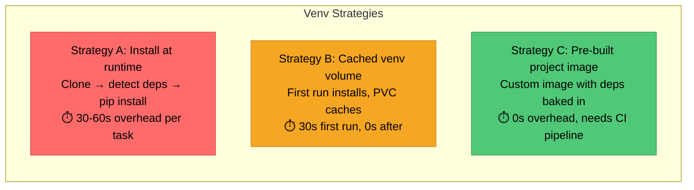
```mermaid
graph LR
    classDef fast fill:#50C878,stroke:#3AA05E,color:#000000
    classDef medium fill:#F5A623,stroke:#D4891A,color:#000000
    classDef slow fill:#FF6B6B,stroke:#D44E4E,color:#000000

    subgraph STRATEGIES["Venv Strategies"]
        A["Strategy A: Install at runtime<br/>Clone → detect deps → pip install<br/>⏱️ 30-60s overhead per task"]:::slow
        B["Strategy B: Cached venv volume<br/>First run installs, PVC caches<br/>⏱️ 30s first run, 0s after"]:::medium
        C["Strategy C: Pre-built project image<br/>Custom image with deps baked in<br/>⏱️ 0s overhead, needs CI pipeline"]:::fast
    end
```

**Recommended: Strategy B (cached venv volume)**

```yaml
# config/agent/runtime/agent.yaml
claude_code:
  workspace:
    venv_cache:
      enabled: true
      volume_type: "pvc"          # persist across tasks
      pvc_name: "claude-venv-cache-{project}"
      auto_detect: true           # detect pyproject.toml / requirements.txt / package.json
      install_command: ""          # auto-detected, or override: "pip install -e .[dev]"
```

```python
# In the runner, before executing Claude Code:
# 1. Check if venv cache PVC exists for this project
# 2. If not: clone repo, create venv, install deps, save to PVC
# 3. Mount PVC at /workspace/.venv
# 4. Claude Code uses the cached venv for tests
```

**Configuration for context injection:**

```yaml
# config/agent/runtime/agent.yaml
claude_code:
  context:
    inject_claude_md: true        # mount CLAUDE.md from repo
    inject_user_memory: true      # mount user's .claude/memory/
    inject_agents: true           # mount .claude/agents/
    inject_settings: false        # mount .claude/settings.json (usually not needed)
    memory_storage: "langraph_store"  # "local" | "pvc" | "langraph_store" | "database"
    extract_memories: true        # extract new memories after execution
    extract_diff: true            # extract git diff after execution
```

## New Files

```
deep_agent/src/claude_code/
├── __init__.py
├── config.py                  # ClaudeCodeConfig, LoopEngineeringConfig, cost models
├── runner.py                  # BaseClaudeCodeRunner, PodmanClaudeCodeRunner, K8sClaudeCodeRunner, ClaudeCodeResult
├── middleware.py              # ClaudeCodeExecutionMiddleware (concurrency, audit, progress)
└── loop_middleware.py         # LoopEngineeringMiddleware (loops, checkpoints via interrupt(), cost breaker)

config/agent/runtime/
└── middleware.yaml            # Add claude_code and loop_engineering sections

tests/unit/
├── test_claude_code_config.py
├── test_claude_code_runner.py
├── test_claude_code_middleware.py
└── test_loop_engineering.py
```

## Container Image

```dockerfile
FROM node:22-slim
RUN apt-get update && \
    apt-get install -y --no-install-recommends git ca-certificates curl && \
    rm -rf /var/lib/apt/lists/*
RUN npm install -g @anthropic-ai/claude-code@2.1.224
RUN useradd -m -s /bin/bash agent
RUN mkdir -p /workspace && chown agent:agent /workspace
USER agent
WORKDIR /workspace
ENTRYPOINT ["claude"]
```

**Verified working** with Podman on macOS (Apple Silicon) using Vertex AI auth. Pinned to version 2.1.224 for reproducible builds.

## Cost Estimation and User Approval

Before running Claude Code, the system estimates cost and asks the user to approve. This happens as the first step in every `claude_code` tool call.

### User Experience

```
User: "Build a shipping calculator API with tests"

Bot:  📊 Cost Estimate

      This task will run Claude Code in a sandbox.
      
      Estimated cost: $2.50 - $7.50
      ├── Complexity: Medium (multi-file, with tests)
      ├── Estimated iterations: 1-3
      ├── Model: Claude Opus 4.6 via Vertex AI
      └── Max budget cap: $25.00
      
      Proceed? [approve / adjust budget / cancel]

User: "approve"

Bot:  Starting... I'll check back with a plan for your review.
```

### Cost Estimation Logic

Task complexity is classified into tiers with estimated token usage:

| Tier | Description | Est. Input Tokens | Est. Output Tokens | Est. Iterations | Cost Range |
|------|------------|-------------------|-------------------|-----------------|------------|
| **Trivial** | Single file change, no tests | 5,000 | 2,000 | 1 | $0.20 - $0.20 |
| **Simple** | Single file + tests, small refactor | 15,000 | 5,000 | 1 | $0.60 - $0.60 |
| **Medium** | Multi-file feature with tests | 40,000 | 15,000 | 2 | $1.70 - $3.40 |
| **Complex** | Full feature, multiple components | 80,000 | 30,000 | 3 | $3.50 - $10.50 |

Classification uses keyword signals from the prompt (rule-based). A future enhancement can use the orchestrator LLM to classify more accurately.

```python
# deep_agent/src/claude_code/cost_estimator.py

COMPLEXITY_TIERS = {
    "trivial": {"estimated_turns": 3, "input_tokens": 5_000, "output_tokens": 2_000, "iterations": 1},
    "simple":  {"estimated_turns": 8, "input_tokens": 15_000, "output_tokens": 5_000, "iterations": 1},
    "medium":  {"estimated_turns": 15, "input_tokens": 40_000, "output_tokens": 15_000, "iterations": 2},
    "complex": {"estimated_turns": 30, "input_tokens": 80_000, "output_tokens": 30_000, "iterations": 3},
}

def estimate_cost(prompt: str, pricing: dict, max_iterations: int) -> dict:
    tier = classify_complexity(prompt)
    spec = COMPLEXITY_TIERS[tier]
    per_iteration = (
        (spec["input_tokens"] / 1000) * pricing.get("input_per_1k", 0.015) +
        (spec["output_tokens"] / 1000) * pricing.get("output_per_1k", 0.075)
    )
    return {
        "complexity": tier,
        "estimated_cost_low": round(per_iteration, 2),
        "estimated_cost_high": round(per_iteration * spec["iterations"], 2),
        "max_possible_cost": round(per_iteration * max_iterations, 2),
    }

def classify_complexity(prompt: str) -> str:
    lower = prompt.lower()
    if any(kw in lower for kw in ["microservice", "full feature", "migration", "refactor across"]):
        return "complex"
    if any(kw in lower for kw in ["with tests", "implement", "build", "create module"]):
        return "medium"
    if any(kw in lower for kw in ["fix bug", "add field", "rename", "update"]):
        return "simple"
    return "medium"
```

The cost estimate is shown to the user via `interrupt()` before execution begins. The user can approve, adjust the budget cap, or cancel.

## Interrupt Strategy: Middleware vs. Subgraph

**Risk:** `langgraph.types.interrupt()` may not work inside middleware `awrap_tool_call()` — it normally operates at the graph node level.

### Decision Process

**Step 1: Spike test (Phase 1, day 1).** Write a minimal test:

```python
# tests/spike/test_interrupt_in_middleware.py

from langgraph.types import interrupt
from langchain.agents.middleware.types import AgentMiddleware

class InterruptTestMiddleware(AgentMiddleware):
    async def awrap_tool_call(self, request, handler):
        if request.tool_call.name == "test_tool":
            decision = interrupt({"question": "proceed?"})
            if decision.get("action") == "cancel":
                return ToolMessage(content="cancelled", tool_call_id=request.tool_call.id)
        return await handler(request)
```

Wire into a minimal LangGraph agent, invoke, check if the graph pauses and resumes correctly.

**Step 2: Route based on result.**

| Spike Result | Strategy | Architecture |
|-------------|----------|-------------|
| `interrupt()` works in middleware | **Strategy A: Middleware** | `LoopEngineeringMiddleware` with `interrupt()` calls. Simplest, least code. |
| `interrupt()` fails in middleware | **Strategy C: Hybrid** | `ClaudeCodeExecutionMiddleware` for simple calls (no checkpoints) + `LoopEngineeringSubgraph` (compiled subgraph) for loops with checkpoints. |

### Strategy A: Middleware (if interrupt works)

```
claude_code tool call
  → LoopEngineeringMiddleware.awrap_tool_call()
    → interrupt() for cost approval        ← blocks, user approves
    → interrupt() for plan review          ← blocks, user reviews
    → loop: handler() → test → fail → retry
    → interrupt() for struggle alert       ← blocks if needed
    → return result
  → ClaudeCodeExecutionMiddleware.awrap_tool_call()
    → runner.execute()
    → return ToolMessage
```

### Strategy C: Hybrid (if interrupt fails in middleware)

```
Orchestrator LLM decides:
  │
  ├── Simple coding task (no checkpoints needed)
  │     → calls claude_code tool
  │     → ClaudeCodeExecutionMiddleware handles directly
  │     → No interrupts, just runs and returns
  │
  └── Complex task (needs checkpoints + loops)
        → calls task("loop-engineer", { prompt: "..." })
        → dispatches LoopEngineeringSubgraph (compiled subagent)
        → Subgraph nodes:
            [estimate_cost] → [interrupt: approve?]
            [plan] → [interrupt: plan_review?]
            [implement_loop] → [test] → pass? → [deliver]
                ↑               │
                └── fail + n<max┘
            [interrupt: struggle?] (after N failures)
            [deliver] → [interrupt: accept?] → end
```

The subgraph is registered as a compiled subagent in `config/agent/subagents/loop-engineer.md`:

```markdown
---
name: loop-engineer
type: compiled
graph: deep_agent.src.claude_code.subgraph:build_loop_engineering_graph
description: Autonomous coding agent with plan→design→implement→test loops
---

You are a loop engineering orchestrator. Given a coding task, you:
1. Estimate cost and get user approval
2. Create a plan and get user review
3. Implement with self-correction loops
4. Deliver results for user acceptance
```

**Both strategies use the same `ClaudeCodeRunner` and `ClaudeCodeExecutionMiddleware`.** Only the loop/checkpoint orchestration layer differs.

## Podman (Local Dev) → K8s (Production) Migration Path

### Environment Parity

The same container image runs in both environments. Only the runner and infrastructure wiring change:

| Concern | Podman (Local Dev) | K8s (Production EKS) |
|---------|-------------------|---------------------|
| **Config** | `runner: "podman"` | `runner: "k8s"` |
| **Runner class** | `PodmanClaudeCodeRunner` | `K8sClaudeCodeRunner` |
| **Container lifecycle** | `podman run --rm` (subprocess) | K8s Job + `ttlSecondsAfterFinished: 30` |
| **Auth** | GCP ADC file bind-mount from `~/.config/gcloud/` | K8s Secret (`gcp-adc-credentials`) or GKE Workload Identity |
| **Network isolation** | Host network (unrestricted, dev only) | NetworkPolicy: egress only to Vertex AI / Anthropic API |
| **Security** | Podman rootless VM (applehv on macOS) | seccomp RuntimeDefault + read-only rootfs + drop ALL caps + non-root UID 1000 |
| **Workspace** | Host directory bind-mount (`-v /path:/workspace`) | `emptyDir` (ephemeral) or PVC (persistent across iterations) |
| **Git integration** | Manual (mount existing checkout) | Init-container: `alpine/git` clones repo into `/workspace` |
| **Logs** | `proc.stdout/stderr` capture | `CoreV1Api.read_namespaced_pod_log()` with streaming |
| **Concurrency** | Single user (dev machine) | Per-org semaphore (default 3) + K8s ResourceQuota |
| **Cleanup** | `--rm` flag (automatic) | Job TTL + explicit delete in finally block |
| **Observability** | Console logs | OTEL spans + audit events + structured JSON logs |

### Implementation Phases

```
Phase 1: LOCAL PODMAN (current Mac setup)
──────────────────────────────────────────
  Day 1:
    ✅ Containerfile built (claude-sandbox:v2.1.224)
    ✅ Podman run with Vertex AI auth verified
    ✅ Headless claude -p returns structured JSON
    ✅ Workspace mount reads/writes files
    → Spike test: interrupt() in middleware
    → Implement ClaudeCodeConfig + PodmanClaudeCodeRunner
    → Implement ClaudeCodeExecutionMiddleware
    → Wire into build_middleware_list()

  Day 2:
    → Implement cost_estimator.py
    → Implement LoopEngineering (middleware or subgraph, based on spike)
    → Unit tests for config, runner, cost estimation
    → Integration test: full flow locally

  Day 3:
    → Wire into template-agent graph.py
    → Test via template-ui chat: "build me X"
    → Verify SSE progress events render in ExecutionOverlay
    → Verify HITL checkpoints work (approve/modify/cancel)


Phase 2: K8S DEPLOYMENT (EKS cluster)
──────────────────────────────────────
  Day 4:
    → Push claude-sandbox:v2.1.224 to container registry (Quay/ECR)
    → Implement K8sClaudeCodeRunner (mirrors K8sJobRunner pattern)
    → Build Job manifest with:
        - activeDeadlineSeconds
        - seccomp + read-only rootfs + drop ALL
        - git init-container (optional)
    → Implement NetworkPolicy for LLM API egress only

  Day 5:
    → Create K8s Secret for GCP ADC (or configure Workload Identity)
    → Deploy to dev/staging EKS cluster
    → Test: verify pod launches, runs claude -p, returns result
    → Test: verify NetworkPolicy blocks non-LLM egress
    → Test: verify cleanup (Job + ConfigMap + NetworkPolicy deleted)

  Day 6:
    → Test workspace persistence with PVC across loop iterations
    → Test git init-container (clone → implement → extract diff)
    → Test per-org concurrency limiting under load
    → Test pod timeout / OOM handling


Phase 3: PRODUCTION HARDENING
──────────────────────────────
  Day 7-8:
    → Audit events via existing AuditMiddleware
    → OTEL spans for execution timing
    → Cost tracking dashboard (per-user, per-org)
    → Alerting: cost exceeded, loop exhausted, pod failures
    → Documentation: runbook for operators
    → Load testing: 10 concurrent users triggering loops
```

## Temporal Integration (Phase 2)

Phase 1 middleware works for dev/testing. Production requires Temporal as the durable execution backbone for ALL tasks — minutes, hours, or days. Phase 1 code (config, runner, cost estimator) is reused as Temporal Activity implementations.

### Why Temporal for Everything

```
Without Temporal (Phase 1 middleware):
  Iteration 1 → pass
  Iteration 2 → pass  
  Iteration 3 → ☠️ POD CRASHES → all state lost, start over

With Temporal (Phase 2):
  Iteration 1 → pass  (checkpointed)
  Iteration 2 → pass  (checkpointed)
  Iteration 3 → ☠️ POD CRASHES → Temporal resumes from iteration 3
```

### Architecture: LangGraph + Temporal

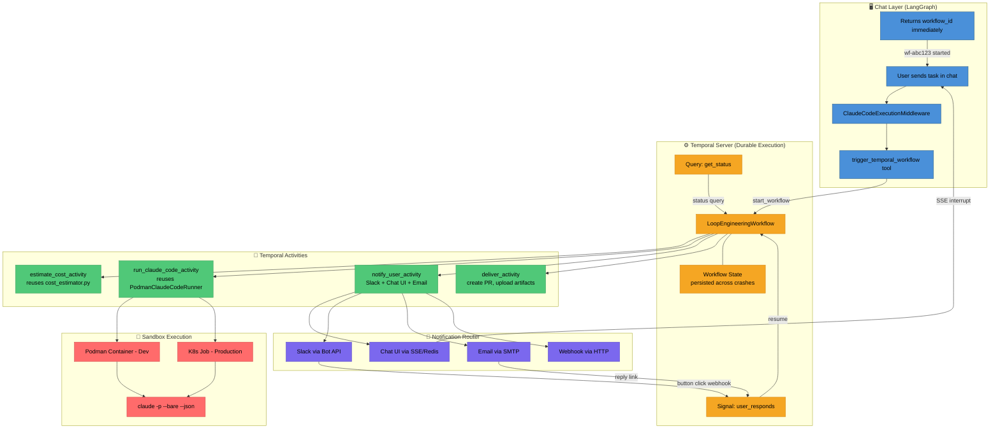
```mermaid
graph TB
    classDef chat fill:#4A90D9,stroke:#2C5F8A,color:#000000
    classDef temporal fill:#F5A623,stroke:#D4891A,color:#000000
    classDef activity fill:#50C878,stroke:#3AA05E,color:#000000
    classDef notify fill:#7B68EE,stroke:#5A4BC7,color:#000000
    classDef sandbox fill:#FF6B6B,stroke:#D44E4E,color:#000000

    subgraph CHAT["🖥️ Chat Layer (LangGraph)"]
        C1[User sends task in chat]
        C2[ClaudeCodeExecutionMiddleware]
        C3[trigger_temporal_workflow tool]
        C4[Returns workflow_id immediately]
    end

    subgraph TEMPORAL["⚙️ Temporal Server (Durable Execution)"]
        T1[LoopEngineeringWorkflow]
        T2[Workflow State<br/>persisted across crashes]
        T3[Signal: user_responds]
        T4[Query: get_status]
    end

    subgraph ACTIVITIES["🔧 Temporal Activities"]
        A1[estimate_cost_activity<br/>reuses cost_estimator.py]
        A2[run_claude_code_activity<br/>reuses PodmanClaudeCodeRunner]
        A3[notify_user_activity<br/>Slack + Chat UI + Email]
        A4[deliver_activity<br/>create PR, upload artifacts]
    end

    subgraph NOTIFY["📢 Notification Router"]
        N1[Chat UI via SSE/Redis]
        N2[Slack via Bot API]
        N3[Email via SMTP]
        N4[Webhook via HTTP]
    end

    subgraph SANDBOX["🐳 Sandbox Execution"]
        S1[Podman Container - Dev]
        S2[K8s Job - Production]
        S3["claude -p --bare --json"]
    end

    C1 --> C2
    C2 --> C3
    C3 -->|start_workflow| T1
    C4 -->|"wf-abc123 started"| C1

    T1 --> A1
    T1 --> A2
    T1 --> A3
    T1 --> A4
    T1 --- T2
    T3 -->|resume| T1
    T4 -->|status query| T1

    A2 --> S1
    A2 --> S2
    S1 --> S3
    S2 --> S3

    A3 --> N1
    A3 --> N2
    A3 --> N3
    A3 --> N4

    N1 -->|SSE interrupt| C1
    N2 -->|button click webhook| T3
    N3 -->|reply link| T3

    class C1,C2,C3,C4 chat
    class T1,T2,T3,T4 temporal
    class A1,A2,A3,A4 activity
    class N1,N2,N3,N4 notify
    class S1,S2,S3 sandbox
```

### Temporal Workflow Definition

```python
@workflow.defn
class LoopEngineeringWorkflow:
    
    def __init__(self):
        self.user_response = None
        self.status = "initializing"
        self.cumulative_cost = 0.0
        self.decision_log = []
    
    @workflow.signal
    async def user_responds(self, response: dict):
        """Receive user response from ANY channel (Slack, UI, Email)."""
        self.user_response = response
        self.decision_log.append({
            "type": response.get("action"),
            "channel": response.get("channel", "unknown"),
            "timestamp": response.get("timestamp"),
        })
    
    @workflow.query
    def get_status(self) -> dict:
        """Query current state — used by UI dashboard."""
        return {
            "status": self.status,
            "cost": self.cumulative_cost,
            "decisions": self.decision_log,
        }
    
    @workflow.run
    async def run(self, task: dict):
        
        # ── Cost Estimate ──
        self.status = "estimating"
        estimate = await workflow.execute_activity(
            estimate_cost_activity,
            args=[task],
            start_to_close_timeout=timedelta(seconds=30),
        )
        
        await self._checkpoint("cost_estimate", estimate)
        if self.user_response["action"] == "cancel":
            return {"status": "cancelled"}
        
        # ── Plan ──
        self.status = "planning"
        plan = await workflow.execute_activity(
            run_claude_code_activity,
            args=[task["prompt"], "planning"],
            start_to_close_timeout=timedelta(minutes=5),
        )
        
        await self._checkpoint("plan_review", plan)
        if self.user_response["action"] == "cancel":
            return {"status": "cancelled"}
        
        # ── Implement (durable loop) ──
        self.status = "implementing"
        error_context = ""
        session_id = None
        max_iter = task.get("max_iterations", 5)
        
        for iteration in range(1, max_iter + 1):
            result = await workflow.execute_activity(
                run_claude_code_activity,
                args=[task["prompt"] + error_context, "implementation"],
                start_to_close_timeout=timedelta(minutes=10),
                retry_policy=RetryPolicy(maximum_attempts=1),
            )
            
            self.cumulative_cost += result["cost"]
            
            # Cost circuit breaker
            if self.cumulative_cost > task.get("max_cost", 25.0):
                await self._notify("cost_exceeded", result)
                return {"status": "cost_exceeded", "cost": self.cumulative_cost}
            
            if result["test_passed"]:
                break
            
            # Struggle alert
            if iteration >= task.get("struggle_threshold", 3):
                await self._checkpoint("struggle_alert", {
                    "iteration": iteration,
                    "error": result["output"][-500:],
                })
                if self.user_response["action"] == "cancel":
                    return {"status": "cancelled"}
                if self.user_response.get("feedback"):
                    error_context += f"\nUSER GUIDANCE: {self.user_response['feedback']}"
            
            error_context = (
                f"\n\nAttempt {iteration} failed:\n"
                f"{result['output'][-2000:]}\n"
                f"Fix the issues."
            )
        
        # ── Deliver ──
        self.status = "delivering"
        await self._checkpoint("delivery", result)
        
        return {
            "status": "complete",
            "cost": self.cumulative_cost,
            "iterations": iteration,
            "decisions": self.decision_log,
        }
    
    async def _checkpoint(self, checkpoint_type: str, data: dict):
        """Notify ALL channels and wait for response."""
        await workflow.execute_activity(
            notify_user_activity,
            args=[checkpoint_type, data, self.cumulative_cost],
            start_to_close_timeout=timedelta(seconds=30),
        )
        self.user_response = None
        await workflow.wait_condition(lambda: self.user_response is not None)
    
    async def _notify(self, event_type: str, data: dict):
        """Notify without waiting."""
        await workflow.execute_activity(
            notify_user_activity,
            args=[event_type, data, self.cumulative_cost],
            start_to_close_timeout=timedelta(seconds=30),
        )
```

### Temporal Activities (Reuse Phase 1 Code)

```python
@activity.defn
async def run_claude_code_activity(prompt: str, task_type: str) -> dict:
    """Run Claude Code in sandbox — wraps PodmanClaudeCodeRunner from Phase 1."""
    config = load_config()
    runner = PodmanClaudeCodeRunner(config)
    result = await runner.execute(prompt, "/workspace", task_type=task_type)
    return {
        "output": result.output,
        "test_passed": result.test_result.passed,
        "cost": result.compute_cost(config.cost.pricing),
        "session_id": result.session_id,
        "tokens_in": result.input_tokens,
        "tokens_out": result.output_tokens,
        "model": result.model,
    }

@activity.defn
async def notify_user_activity(
    checkpoint_type: str, data: dict, cumulative_cost: float
) -> None:
    """Send notification via ALL configured channels."""
    notification = build_notification(checkpoint_type, data, cumulative_cost)
    
    # Always: Chat UI via Redis pub/sub → SSE
    await notify_chat_ui(notification)
    
    # If configured: Slack
    if slack_configured():
        await send_slack_notification(notification)
    
    # If configured: Email
    if email_configured():
        await send_email_notification(notification)

@activity.defn
async def estimate_cost_activity(task: dict) -> dict:
    """Reuses Phase 1 cost_estimator.py."""
    from deep_agent.src.claude_code.cost_estimator import estimate_cost
    config = load_config()
    return estimate_cost(task["prompt"], config.cost.pricing, task.get("max_iterations", 5))
```

### Middleware Becomes Temporal Trigger

```python
# Phase 2: ClaudeCodeExecutionMiddleware changes to trigger Temporal

async def awrap_tool_call(self, request, handler):
    if tool_call.get("name") != "claude_code":
        return await handler(request)
    
    workflow_id = await self._temporal_client.start_workflow(
        "LoopEngineeringWorkflow",
        args=[{
            "prompt": args["prompt"],
            "task_type": args.get("task_type", "default"),
            "max_iterations": self._loop_config.max_iterations,
            "max_cost": self._cost_config.max_cost_usd_per_loop,
            "struggle_threshold": self._loop_config.struggle_threshold,
        }],
        id=f"loop-{uuid4().hex[:8]}",
        task_queue="claude-code-workers",
    )
    
    return ToolMessage(
        content=f"Started loop engineering workflow: {workflow_id}\n"
                f"I'll notify you at each checkpoint via chat and Slack.\n"
                f"You can check status anytime by asking me.",
        tool_call_id=tool_call_id,
    )
```

## Slack Integration (Phase 3)

Slack serves as an async HITL transport — users can respond to agent checkpoints when away from the chat UI.

### Notification Flow

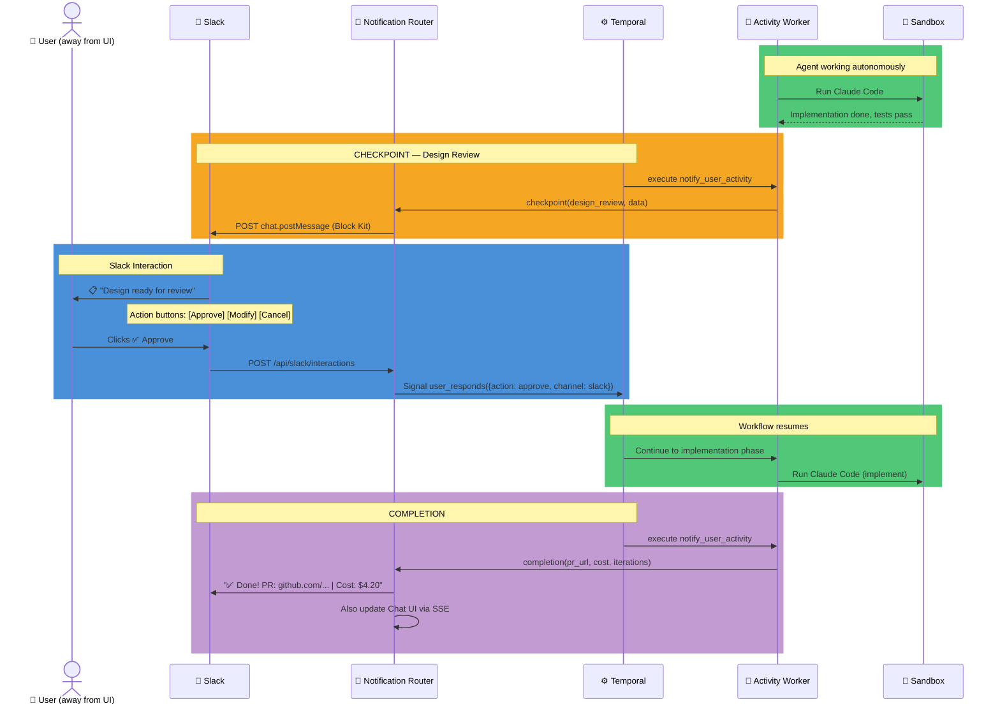
```mermaid
sequenceDiagram
    actor User as 👤 User (away from UI)
    participant Slack as 💬 Slack
    participant Router as 📢 Notification Router
    participant Temporal as ⚙️ Temporal
    participant Worker as 🔧 Activity Worker
    participant Sandbox as 🐳 Sandbox

    rect rgb(80, 200, 120)
        Note over Worker,Sandbox: Agent working autonomously
        Worker->>Sandbox: Run Claude Code
        Sandbox-->>Worker: Implementation done, tests pass
    end

    rect rgb(245, 166, 35)
        Note over Temporal,Slack: CHECKPOINT — Design Review
        Temporal->>Worker: execute notify_user_activity
        Worker->>Router: checkpoint(design_review, data)
        Router->>Slack: POST chat.postMessage (Block Kit)
    end

    rect rgb(74, 144, 217)
        Note over Slack,User: Slack Interaction
        Slack->>User: 📋 "Design ready for review"
        Note over Slack: Action buttons: [Approve] [Modify] [Cancel]
        User->>Slack: Clicks ✅ Approve
        Slack->>Router: POST /api/slack/interactions
        Router->>Temporal: Signal user_responds({action: approve, channel: slack})
    end

    rect rgb(80, 200, 120)
        Note over Temporal,Sandbox: Workflow resumes
        Temporal->>Worker: Continue to implementation phase
        Worker->>Sandbox: Run Claude Code (implement)
    end

    rect rgb(195, 155, 211)
        Note over Temporal,Slack: COMPLETION
        Temporal->>Worker: execute notify_user_activity
        Worker->>Router: completion(pr_url, cost, iterations)
        Router->>Slack: "✅ Done! PR: github.com/... | Cost: $4.20"
        Router->>Router: Also update Chat UI via SSE
    end
```

### Slack App Setup

**Required scopes:**
- `chat:write` — send messages
- `chat:write.public` — post to channels the bot isn't in
- `users:read` — resolve user IDs

**Required features:**
- **Interactivity** enabled — request URL: `https://<bff-host>/api/slack/interactions`
- **Slash commands** (optional) — `/loop status <workflow-id>` to check progress

**Environment variables:**
```yaml
SLACK_BOT_TOKEN: "xoxb-..."          # from Slack App OAuth
SLACK_SIGNING_SECRET: "..."           # verify webhook authenticity
SLACK_DEFAULT_CHANNEL: "#loop-eng"    # default notification channel
```

### Slack Message Templates (Block Kit)

**Checkpoint notification:**
```json
{
  "blocks": [
    {
      "type": "header",
      "text": {"type": "plain_text", "text": "📋 Design Review Required"}
    },
    {
      "type": "section",
      "fields": [
        {"type": "mrkdwn", "text": "*Task:*\nBuild shipping calculator API"},
        {"type": "mrkdwn", "text": "*Phase:*\nDesign Review"},
        {"type": "mrkdwn", "text": "*Cost so far:*\n$1.20"},
        {"type": "mrkdwn", "text": "*Model:*\nclaude-opus-4-6"}
      ]
    },
    {
      "type": "section",
      "text": {"type": "mrkdwn", "text": "*Design Summary:*\n• `shipping_rates` table (zone, weight, price)\n• `POST /v1/shipping/calculate` endpoint\n• Input validation + error handling"}
    },
    {
      "type": "actions",
      "block_id": "checkpoint_actions",
      "elements": [
        {
          "type": "button",
          "text": {"type": "plain_text", "text": "✅ Approve"},
          "style": "primary",
          "action_id": "approve",
          "value": "wf-abc123"
        },
        {
          "type": "button",
          "text": {"type": "plain_text", "text": "✏️ Modify"},
          "action_id": "modify",
          "value": "wf-abc123"
        },
        {
          "type": "button",
          "text": {"type": "plain_text", "text": "❌ Cancel"},
          "style": "danger",
          "action_id": "cancel",
          "value": "wf-abc123"
        }
      ]
    }
  ]
}
```

**Completion notification:**
```json
{
  "blocks": [
    {
      "type": "header",
      "text": {"type": "plain_text", "text": "✅ Task Complete"}
    },
    {
      "type": "section",
      "fields": [
        {"type": "mrkdwn", "text": "*Task:*\nBuild shipping calculator API"},
        {"type": "mrkdwn", "text": "*PR:*\n<https://github.com/org/repo/pull/42|#42>"},
        {"type": "mrkdwn", "text": "*Total Cost:*\n$4.20"},
        {"type": "mrkdwn", "text": "*Iterations:*\n2"}
      ]
    },
    {
      "type": "section",
      "text": {"type": "mrkdwn", "text": "📊 *Usage:* opus (impl) + sonnet (tests) | 45K/12K tokens | 2 iterations | 3 decisions"}
    }
  ]
}
```

**Struggle alert:**
```json
{
  "blocks": [
    {
      "type": "header",
      "text": {"type": "plain_text", "text": "⚠️ Agent Needs Help"}
    },
    {
      "type": "section",
      "text": {"type": "mrkdwn", "text": "*Task:* Build shipping calculator API\n*Failed:* 3 times\n*Last error:* `AssertionError: expected 200 but got 422`\n*Cost so far:* $8.50"}
    },
    {
      "type": "input",
      "block_id": "guidance_input",
      "element": {
        "type": "plain_text_input",
        "action_id": "guidance_text",
        "placeholder": {"type": "plain_text", "text": "Type guidance for the agent..."}
      },
      "label": {"type": "plain_text", "text": "Your guidance (optional)"}
    },
    {
      "type": "actions",
      "elements": [
        {
          "type": "button",
          "text": {"type": "plain_text", "text": "🔄 Continue"},
          "style": "primary",
          "action_id": "continue",
          "value": "wf-abc123"
        },
        {
          "type": "button",
          "text": {"type": "plain_text", "text": "💬 Send Guidance"},
          "action_id": "intervene",
          "value": "wf-abc123"
        },
        {
          "type": "button",
          "text": {"type": "plain_text", "text": "❌ Cancel"},
          "style": "danger",
          "action_id": "cancel",
          "value": "wf-abc123"
        }
      ]
    }
  ]
}
```

### Slack Interaction Handler

```python
# deep_agent/src/claude_code/slack/interaction_handler.py

@app.post("/api/slack/interactions")
async def handle_slack_interaction(request: Request):
    """Handle button clicks and form submissions from Slack."""
    # Verify Slack signature
    verify_slack_signature(request, SLACK_SIGNING_SECRET)
    
    payload = json.loads((await request.form())["payload"])
    action = payload["actions"][0]
    workflow_id = action["value"]
    action_id = action["action_id"]
    user = payload["user"]["username"]
    
    if action_id == "modify":
        # Open modal for user to type feedback
        await slack_client.views_open(
            trigger_id=payload["trigger_id"],
            view=build_modify_modal(workflow_id),
        )
        return {"status": "ok"}
    
    if action_id == "intervene":
        # Extract guidance text from the input block
        guidance = extract_input_value(payload, "guidance_input", "guidance_text")
        await send_temporal_signal(workflow_id, {
            "action": "intervene",
            "feedback": guidance,
            "channel": "slack",
            "user": user,
        })
    else:
        await send_temporal_signal(workflow_id, {
            "action": action_id,
            "channel": "slack",
            "user": user,
        })
    
    # Update the Slack message to show decision was made
    await slack_client.chat_update(
        channel=payload["channel"]["id"],
        ts=payload["message"]["ts"],
        text=f"✅ {action_id.title()}d by @{user}",
        blocks=[{
            "type": "section",
            "text": {"type": "mrkdwn", "text": f"✅ *{action_id.title()}* by @{user}"}
        }],
    )
    
    return {"status": "ok"}


async def send_temporal_signal(workflow_id: str, response: dict):
    """Send user response as Temporal Signal."""
    handle = temporal_client.get_workflow_handle(workflow_id)
    await handle.signal("user_responds", response)
```

### Notification Router

```python
# deep_agent/src/claude_code/notifications/router.py

class NotificationRouter:
    """Route notifications to all configured channels."""
    
    def __init__(self, config: NotificationConfig):
        self.channels = []
        
        # Always: Chat UI via Redis pub/sub
        self.channels.append(ChatUINotifier(config.redis_url))
        
        # Optional: Slack
        if config.slack_bot_token:
            self.channels.append(SlackNotifier(
                bot_token=config.slack_bot_token,
                default_channel=config.slack_default_channel,
            ))
        
        # Optional: Email
        if config.smtp_host:
            self.channels.append(EmailNotifier(config))
        
        # Optional: Webhook
        if config.webhook_url:
            self.channels.append(WebhookNotifier(config.webhook_url))
    
    async def notify(self, notification: Notification) -> None:
        """Send to ALL channels concurrently."""
        await asyncio.gather(
            *[ch.send(notification) for ch in self.channels],
            return_exceptions=True,
        )
```

### New Files (Slack + Temporal)

```
deep_agent/src/claude_code/
├── __init__.py                    # Phase 1 ✅
├── config.py                      # Phase 1 ✅
├── cost_estimator.py              # Phase 1 ✅
├── runner.py                      # Phase 1 ✅
├── middleware.py                  # Phase 1 ✅ (becomes Temporal trigger in Phase 2)
├── loop_middleware.py             # Phase 1 ✅ (replaced by Temporal Workflow in Phase 2)
├── temporal/                      # Phase 2
│   ├── __init__.py
│   ├── workflows.py              # LoopEngineeringWorkflow
│   ├── activities.py             # run_claude_code, notify_user, estimate_cost
│   └── worker.py                 # Temporal Worker entrypoint
├── notifications/                 # Phase 2-3
│   ├── __init__.py
│   ├── router.py                 # NotificationRouter (multi-channel)
│   ├── chat_ui.py                # Redis pub/sub → SSE
│   └── models.py                 # Notification, CheckpointNotification
└── slack/                         # Phase 3
    ├── __init__.py
    ├── notifier.py               # SlackNotifier (send Block Kit messages)
    ├── interaction_handler.py    # Handle button clicks, modals
    └── templates.py              # Block Kit message templates
```

### Configuration (Slack + Notifications)

```yaml
# config/agent/runtime/middleware.yaml

notifications:
  enabled: true
  channels:
    chat_ui:
      enabled: true                # always on
      redis_url: "redis://localhost:6379"
    slack:
      enabled: false
      bot_token: ""                # from SLACK_BOT_TOKEN env var
      signing_secret: ""           # from SLACK_SIGNING_SECRET env var
      default_channel: "#loop-engineering"
      mention_user: true           # @mention the user who started the task
    email:
      enabled: false
      smtp_host: ""
      smtp_port: 587
      from_address: "loop-eng@company.com"
    webhook:
      enabled: false
      url: ""
      headers: {}
```

## GitHub Integration and User Profile Settings

### Git Operations in the Sandbox

Claude Code running in the sandbox can clone repos, create branches, write code, commit, push, and open PRs — provided it has git credentials.

**Verified working flow:**
```
1. Clone repo  → git clone https://<token>@github.com/org/repo.git /workspace/repo
2. Create branch → git checkout -b feat/my-feature
3. Read code   → Claude Code reads existing files
4. Write code  → Claude Code writes new/modified files
5. Run tests   → Claude Code runs pytest/npm test (if deps available)
6. Commit      → git add + git commit
7. Push        → git push origin feat/my-feature
8. Open PR     → gh pr create (if gh CLI available) or GitHub API
```

**How credentials are passed to the sandbox:**

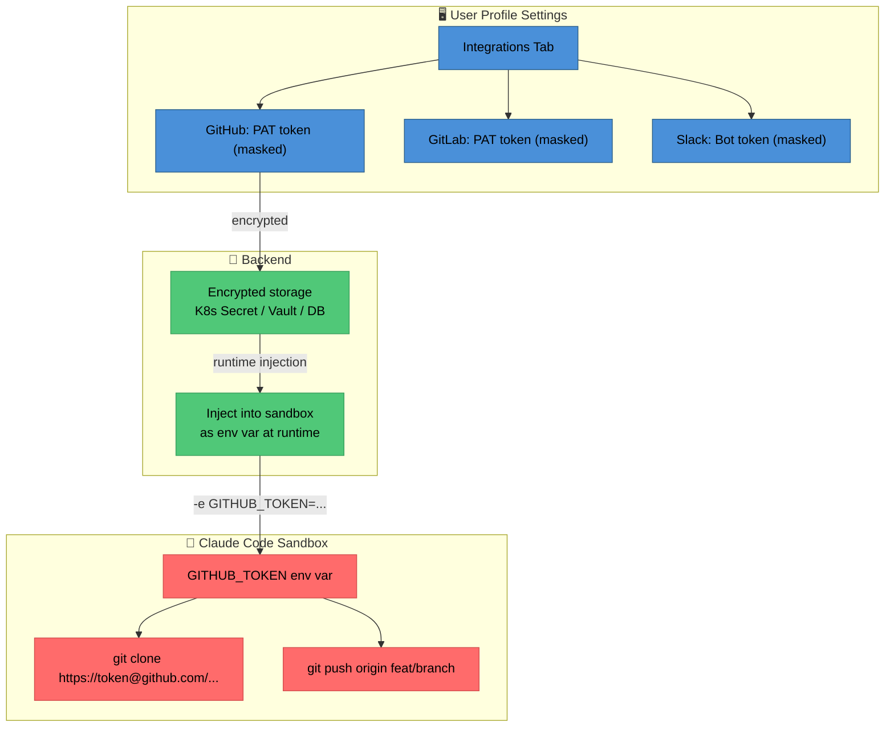
```mermaid
graph TB
    classDef ui fill:#4A90D9,stroke:#2C5F8A,color:#000000
    classDef backend fill:#50C878,stroke:#3AA05E,color:#000000
    classDef sandbox fill:#FF6B6B,stroke:#D44E4E,color:#000000
    classDef store fill:#F5A623,stroke:#D4891A,color:#000000

    subgraph UI["🖥️ User Profile Settings"]
        U1[Integrations Tab]
        U2["GitHub: PAT token (masked)"]
        U3["GitLab: PAT token (masked)"]
        U4["Slack: Bot token (masked)"]
    end

    subgraph BACKEND["🔧 Backend"]
        B1[Encrypted storage<br/>K8s Secret / Vault / DB]
        B2[Inject into sandbox<br/>as env var at runtime]
    end

    subgraph SANDBOX["🐳 Claude Code Sandbox"]
        S1[GITHUB_TOKEN env var]
        S2["git clone https://token@github.com/..."]
        S3[git push origin feat/branch]
    end

    U1 --> U2
    U1 --> U3
    U1 --> U4
    U2 -->|encrypted| B1
    B1 -->|runtime injection| B2
    B2 -->|"-e GITHUB_TOKEN=..."| S1
    S1 --> S2
    S1 --> S3

    class U1,U2,U3,U4 ui
    class B1,B2 backend
    class S1,S2,S3 sandbox
```

### User Profile: Integrations Section (UI)

New section in template-ui Settings page where users configure their external service credentials:

```
┌──────────────────────────────────────────────────────────┐
│ Settings                                                  │
│                                                          │
│ [General] [Appearance] [Voice] [Integrations] [Approvals]│
│                                                          │
│ ┌─ Integrations ─────────────────────────────────────┐  │
│ │                                                     │  │
│ │  GitHub                                    🟢 Connected│
│ │  ┌─────────────────────────────────────────────┐   │  │
│ │  │ PAT Token: ghp_••••••••••••••••last4       │   │  │
│ │  │ [Update] [Revoke] [Test Connection]        │   │  │
│ │  │ Scope: repo, workflow                      │   │  │
│ │  │ Default org: saharannaveen                 │   │  │
│ │  └─────────────────────────────────────────────┘   │  │
│ │                                                     │  │
│ │  GitLab                                   🔴 Not Set  │
│ │  ┌─────────────────────────────────────────────┐   │  │
│ │  │ PAT Token: [Enter token...]                │   │  │
│ │  │ Instance URL: [https://gitlab.example.com] │   │  │
│ │  │ [Connect]                                  │   │  │
│ │  └─────────────────────────────────────────────┘   │  │
│ │                                                     │  │
│ │  Slack                                    🔴 Not Set  │
│ │  ┌─────────────────────────────────────────────┐   │  │
│ │  │ Notification Channel: [#loop-engineering]  │   │  │
│ │  │ [Connect via OAuth]                        │   │  │
│ │  └─────────────────────────────────────────────┘   │  │
│ │                                                     │  │
│ └─────────────────────────────────────────────────────┘  │
└──────────────────────────────────────────────────────────┘
```

**Backend API for integrations:**

```yaml
# Endpoints
POST   /api/integrations/github     # Store encrypted PAT
DELETE /api/integrations/github     # Revoke
GET    /api/integrations/github/test # Test connection (returns user info)
GET    /api/integrations             # List all integrations + status

# Request body
{ "token": "ghp_xxxxx", "default_org": "saharannaveen" }

# Storage: encrypted at rest
# Local: encrypted file in ~/.claude/integrations/
# K8s: per-user K8s Secret
# Enterprise: HashiCorp Vault or AWS Secrets Manager
```

**How the runner uses it:**

```python
# deep_agent/src/claude_code/runner.py

class PodmanClaudeCodeRunner(BaseClaudeCodeRunner):
    
    def _build_git_env_args(self, user_integrations: dict) -> list[str]:
        """Inject git credentials from user integrations."""
        env_args = []
        
        github_token = user_integrations.get("github", {}).get("token")
        if github_token:
            env_args.extend(["-e", f"GITHUB_TOKEN={github_token}"])
            # Configure git to use token for HTTPS
            env_args.extend(["-e", "GIT_ASKPASS=echo"])
        
        gitlab_token = user_integrations.get("gitlab", {}).get("token")
        if gitlab_token:
            env_args.extend(["-e", f"GITLAB_TOKEN={gitlab_token}"])
        
        return env_args
```

**Security considerations:**
- Tokens are encrypted at rest (never stored in plaintext)
- Tokens are injected as env vars at runtime (not baked into images)
- Container isolation prevents token leakage between users
- Network policy restricts egress to GitHub/GitLab APIs only
- Tokens are masked in UI (show last 4 chars only)
- Tokens can be revoked from the UI at any time
- Audit log records every git operation

### Complete Git Workflow in Sandbox

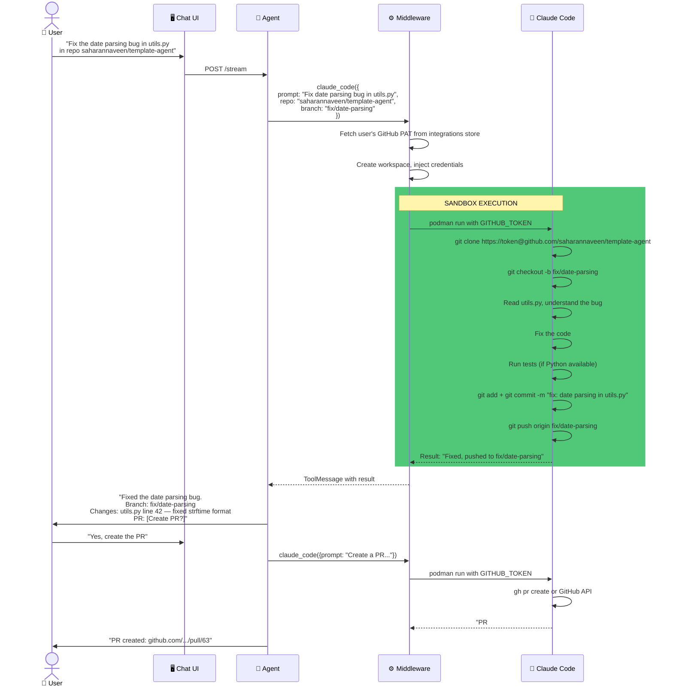
```mermaid
sequenceDiagram
    actor User as 👤 User
    participant UI as 🖥️ Chat UI
    participant Agent as 🤖 Agent
    participant MW as ⚙️ Middleware
    participant CC as 🐳 Claude Code

    User->>UI: "Fix the date parsing bug in utils.py<br/>in repo saharannaveen/template-agent"

    UI->>Agent: POST /stream
    Agent->>MW: claude_code({<br/>  prompt: "Fix date parsing bug in utils.py",<br/>  repo: "saharannaveen/template-agent",<br/>  branch: "fix/date-parsing"<br/>})

    MW->>MW: Fetch user's GitHub PAT from integrations store
    MW->>MW: Create workspace, inject credentials

    rect rgb(80, 200, 120)
        Note over MW,CC: SANDBOX EXECUTION
        MW->>CC: podman run with GITHUB_TOKEN
        CC->>CC: git clone https://token@github.com/saharannaveen/template-agent
        CC->>CC: git checkout -b fix/date-parsing
        CC->>CC: Read utils.py, understand the bug
        CC->>CC: Fix the code
        CC->>CC: Run tests (if Python available)
        CC->>CC: git add + git commit -m "fix: date parsing in utils.py"
        CC->>CC: git push origin fix/date-parsing
        CC-->>MW: Result: "Fixed, pushed to fix/date-parsing"
    end

    MW-->>Agent: ToolMessage with result
    Agent->>User: "Fixed the date parsing bug.<br/>Branch: fix/date-parsing<br/>Changes: utils.py line 42 — fixed strftime format<br/>PR: [Create PR?]"

    User->>UI: "Yes, create the PR"
    Agent->>MW: claude_code({prompt: "Create a PR..."})
    MW->>CC: podman run with GITHUB_TOKEN
    CC->>CC: gh pr create or GitHub API
    CC-->>MW: "PR #63 created"
    Agent->>User: "PR created: github.com/.../pull/63"
```

## Persistent Sandbox Sessions (Core Architecture)

Loop Engineering is NOT a tool that runs and dies. It is a **persistent coding environment** — like Bolt, Lovable, or Replit — where the container stays alive, state persists across tasks, and the user has a continuous back-and-forth with the coding agent.

### Session Lifecycle

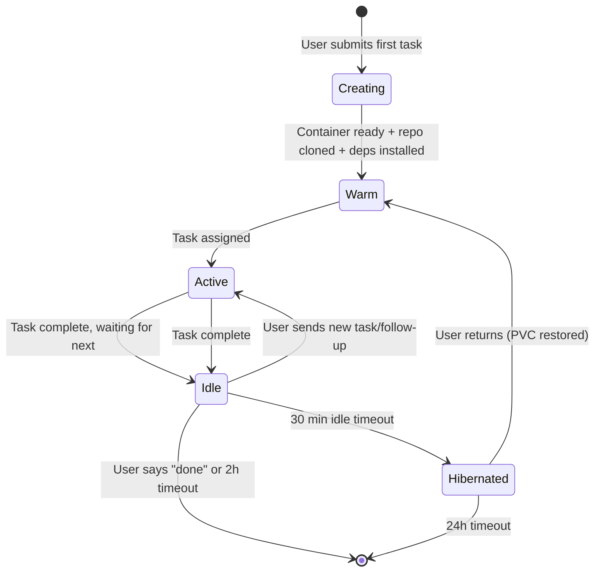
```mermaid
stateDiagram-v2
    classDef active fill:#50C878,color:#000000
    classDef idle fill:#F5A623,color:#000000
    classDef hibernated fill:#4A90D9,color:#000000
    classDef dead fill:#FF6B6B,color:#000000

    [*] --> Creating: User submits first task
    Creating --> Warm: Container ready + repo cloned + deps installed
    Warm --> Active: Task assigned
    Active --> Idle: Task complete, waiting for next
    Idle --> Active: User sends new task/follow-up
    Idle --> Hibernated: 30 min idle timeout
    Hibernated --> Warm: User returns (PVC restored)
    Idle --> [*]: User says "done" or 2h timeout
    Hibernated --> [*]: 24h timeout
    Active --> Idle: Task complete
```

### How It Works

```
Session 1 (user's first task):
  ┌─ CREATE ──────────────────────────────┐
  │  Clone repo → install deps → WARM     │  (60s cold start, only ONCE)
  └───────────────────────────────────────┘
  ┌─ TASK 1 ──────────────────────────────┐
  │  User: "Build a TODO app"             │
  │  Claude Code: writes code, tests      │  (2-5 min)
  │  Result posted to chat                │
  └───────────────────────────────────────┘
  ┌─ IDLE (waiting) ──────────────────────┐
  │  Container alive, state preserved     │
  │  User can send follow-up anytime      │
  └───────────────────────────────────────┘
  ┌─ TASK 2 ──────────────────────────────┐
  │  User: "Add pagination to the API"    │
  │  Claude Code: reads EXISTING code,    │
  │  modifies it (instant, no clone)      │  (1-2 min)
  │  Result posted to chat                │
  └───────────────────────────────────────┘
  ┌─ TASK 3 ──────────────────────────────┐
  │  User: "Fix the test that failed"     │
  │  Claude Code: same container, same    │
  │  code, knows the context              │  (30s)
  └───────────────────────────────────────┘
  ... 30 min idle ...
  ┌─ HIBERNATE ───────────────────────────┐
  │  Container stopped, PVC preserved     │
  │  State saved to disk                  │
  └───────────────────────────────────────┘
  ... user comes back next day ...
  ┌─ RESUME ──────────────────────────────┐
  │  PVC restored, container starts       │
  │  Code, venv, git state all intact     │  (5-10s)
  └───────────────────────────────────────┘
```

### Temporal Workflow: CodingSessionWorkflow

The Temporal workflow represents a **session**, not a single task. It stays alive processing multiple tasks:

```python
@workflow.defn
class CodingSessionWorkflow:
    """Persistent coding session — container stays alive across tasks."""
    
    @workflow.run
    async def run(self, session: dict):
        # Phase 1: Create sandbox ONCE
        container = await create_sandbox(session)  # clone, install, warm
        
        # Phase 2: Process tasks in a loop
        while True:
            task = await wait_for_task(timeout=30min)
            
            if task is None:  # idle timeout
                await hibernate(container)
                break
            
            if task["action"] == "close":
                break
            
            # Execute in the SAME container
            result = await execute_in_container(container, task)
            await post_to_chat(result)
        
        # Phase 3: Cleanup
        await destroy_sandbox(container)
    
    @workflow.signal
    async def submit_task(self, task): ...
    
    @workflow.signal
    async def user_message(self, message): ...
    
    @workflow.signal
    async def close_session(self): ...
```

### Container Management

**Local (Podman):**
- Container created with `podman run` (not `--rm` — stays alive)
- Workspace at `~/.claude-workspaces/{session-id}/`
- Subsequent tasks: `podman exec` into the SAME container
- Hibernate: `podman stop` + keep workspace directory
- Resume: `podman start` or new container mounting same workspace

**Production (K8s):**
- Pod created as a Deployment (not a Job)
- Workspace on PVC: `workspace-{session-id}`
- Subsequent tasks: exec into the running pod
- Hibernate: scale Deployment to 0, PVC persists
- Resume: scale to 1, PVC remounted

### What Changes from Current Architecture

| Component | Current | Session-based |
|-----------|---------|---------------|
| Container lifecycle | Created + destroyed per task | Persistent, reused across tasks |
| Workspace | tempdir, deleted after | PVC/persistent dir, survives |
| Repo clone | Every task | Once per session |
| Deps install | Every task | Once per session |
| Git state | Lost | Preserved (branches, commits) |
| Claude Code context | Fresh each time | Accumulates across tasks |
| User memory | Injected from host | Lives IN the container |
| Temporal workflow | Completes after one task | Stays alive for the session |
| Runner | `podman run --rm` | `podman run` + `podman exec` |

## Developer Experience in Sandbox

The sandbox should feel like a developer's local Claude Code setup — with plugins, skills, settings, and session history.

### What persists across sessions (via PVC / mounted volume):

```
~/.claude-homes/{user_id}/          ← Persistent per-user Claude Code state
├── plugins/                        ← Installed plugins (superpowers, context7, etc.)
├── agents/                         ← Custom agent definitions
├── commands/                       ← Custom slash commands
├── memory/                         ← User preferences, learnings
├── settings.json                   ← Permissions, model prefs
├── sessions/                       ← Session history (--resume works!)
└── .plugins-installed              ← Flag: skip install on subsequent runs
```

### Configuration:

```yaml
# config/agent/runtime/agent.yaml
claude_code:
  # Plugins to install on first run
  plugins: "superpowers context7 feature-dev"
  
  # Claude Code version management
  image: "claude-sandbox:v2.1.224"    # pinned version
  auto_update: false                   # if true, check for updates on session start
  
  # Session resume
  persist_sessions: true               # mount ~/.claude/ on PVC
  session_timeout: "30m"               # container hibernates after idle
  workflow_timeout: "7d"               # Temporal workflow max lifetime
```

### Claude Code Updates:

```
Current version: v2.1.224 (pinned in image tag)

Update process:
  1. Build new image:  podman build -t claude-sandbox:v2.2.0 ...
  2. Update config:    image: "claude-sandbox:v2.2.0"
  3. Running sessions: continue on old image until complete
  4. New sessions:     use new image automatically
  5. PVC data:         persists across image updates (plugins, settings, sessions)
```

## Implementation Phases (Updated)

```
Phase 1 (DONE): Config + Runner + Middleware (direct execution)
  ✅ ClaudeCodeConfig, LoopEngineeringConfig, ModelRoutingConfig
  ✅ ClaudeCodeResult, PodmanClaudeCodeRunner
  ✅ ClaudeCodeExecutionMiddleware (direct sandbox execution)
  ✅ LoopEngineeringMiddleware (in-process loops)
  ✅ Cost estimator, test-result detection
  └── Works standalone for dev/testing

Phase 2: Temporal Integration
  → LoopEngineeringWorkflow (durable execution)
  → Activities wrapping Phase 1 code
  → Middleware → Temporal trigger
  → Notification router (multi-channel)
  → Chat UI ↔ Temporal bridge (Redis pub/sub)
  → Temporal Worker deployment

Phase 3: Slack Integration
  → Slack App setup (bot token, interactivity)
  → SlackNotifier (Block Kit messages with action buttons)
  → Interaction webhook handler (button clicks → Temporal Signals)
  → Modify modal (text input for user feedback)
  → Message update after decision

Phase 4: UI Enhancements
  → Quick-start use case cards on home page
  → SDLC Dashboard (phase tracking, decision log, artifacts)
  → Voice interaction (STT/TTS)
  → Workflow history and replay
```

## Lessons Learned & Architecture Decisions (from implementation)

### Decision Log

| # | Decision | Why | Impact |
|---|----------|-----|--------|
| 1 | Claude Code runs ONLY through Temporal | Agent restarts kill in-flight executions; Temporal survives restarts | All execution via Temporal worker, never direct from middleware |
| 2 | Session-based containers, not disposable | Cold start (clone + deps) takes 30-60s; reuse eliminates this | Container stays alive across tasks in same thread |
| 3 | Middleware returns immediately | `await handle.result()` blocks SSE stream for minutes → timeout | Submit to Temporal, return workflow ID, result comes via callback |
| 4 | Workflow stays alive after container hibernates | User may respond hours/days later; Temporal handles this for free | Container stops on 30m idle, workflow waits indefinitely |
| 5 | PII URL redaction disabled | `execute_code` didn't use URLs; `claude_code` needs GitHub URLs | Config: `pii.rules` removed `url: redact` |
| 6 | LLM handles git URLs, no regex extraction | Regex extraction fragile (trailing dots, branch name confusion) | Prompt includes URL naturally, entrypoint configures credentials |
| 7 | Notification type is plain `str` | Literal validation kept crashing on new event types | `Notification.type: str` instead of `Literal[...]` |
| 8 | User identity mismatch in dev mode | Curl creates `user_id: anonymous`, UI uses `user_identity: johnwick` | Workflows API returns all in dev mode |
| 9 | BFF needs same Redis as backend | Pub/sub only works on same Redis instance | BFF `.env` needs `REDIS_HOST=localhost` pointing to backend Redis |
| 10 | Container entrypoint handles git | Claude Code redacts tokens in URLs | Entrypoint configures `~/.git-credentials` from GITHUB_TOKEN env var |
| 11 | Persistent .claude directory per user | Plugins, sessions, settings need to survive across containers | Mounted from `~/.claude-homes/{user_id}/` |

### Bugs Found & Fixed During Implementation

| Bug | Root Cause | Fix |
|-----|-----------|-----|
| `vertex_project_id` always empty | YAML doesn't resolve `${ENV_VAR}` | Fall back to `os.environ.get()` in runner |
| GCP credentials path wrong | Host path used instead of container path | Use canonical `/gcp/application_default_credentials.json` |
| JSON field names wrong (`output` vs `result`) | Claude Code CLI uses different field names | Parse `result`, `session_id`, `is_error` from JSON |
| Workspace mount fails on macOS | `/tmp` not shared with Podman VM | Use `~/.claude-workspaces/` under home dir |
| Container exit code 137 | `--rm` flag on container; OOM or signal kill | Remove `--rm`, use persistent containers |
| `max_iterations: 50` (should be 5) | Passed `max_turns` (CLI flag) as loop iterations | Hardcode `max_iterations: 5` |
| Branch extraction picks up "from" | Regex `(?:branch)\s+([\w\-/]+)` matches "branch from" | Multi-pattern matching with stopword filter |
| Workflows page crashes | API returns `workflow_id` but UI expects `id` | Map snake_case → camelCase in workflow-api.ts |
| `execute_code` fails locally | `kubernetes` Python package not installed | `pip install kubernetes` in `.venv-dynamic-subagent` |

### Architecture Evolution

```
V1 (initial):
  Middleware → podman run --rm → result → chat
  Problems: no durability, cold start, agent restart kills execution

V2 (Temporal added):
  Middleware → Temporal workflow → worker → podman run --rm → result
  Problems: middleware blocks on await handle.result(), SSE times out

V3 (async):
  Middleware → Temporal workflow → returns immediately
  Worker → runs Claude Code → posts result back to chat
  Problems: new container per task, cold start, no state

V4 (session-based — current):
  Middleware → check for existing session → signal or create
  Temporal CodingSessionWorkflow → persistent container
  Container stays alive → multiple tasks → 30m idle → hibernate
  Workflow stays alive → can resume anytime
  Result → post_result_to_chat_activity → appears in chat
```

### Communication Bridge

```
Temporal → Chat (notifications):
  notify_user_activity → Redis pub/sub → BFF SSE → Chat UI
  post_result_to_chat_activity → HTTP POST to agent API → thread message

Chat → Temporal (user replies):
  POST /api/workflows/{id}/respond → Temporal signal → workflow resumes

Thread ↔ Workflow mapping:
  Redis key: loop-engineering:thread-workflow:{thread_id} → workflow_id
  workflow_store.get_by_thread(thread_id) → find active session
```

### Complete System Flow

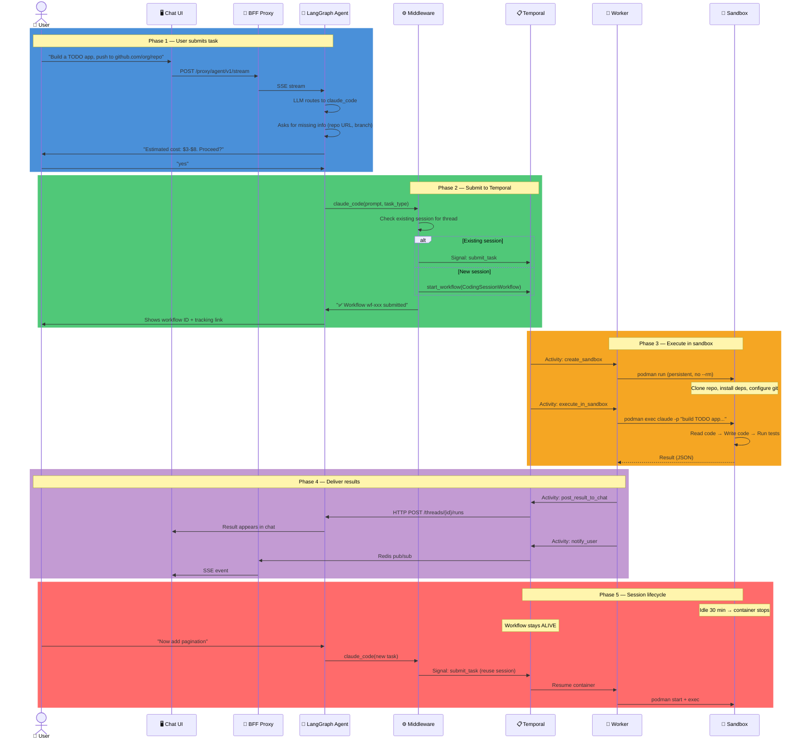
```mermaid
sequenceDiagram
    actor User as 👤 User
    participant UI as 🖥️ Chat UI
    participant BFF as 📡 BFF Proxy
    participant Agent as 🤖 LangGraph Agent
    participant MW as ⚙️ Middleware
    participant Temporal as 📋 Temporal
    participant Worker as 🔧 Worker
    participant Container as 🐳 Sandbox

    rect rgb(74, 144, 217)
        Note over User,Agent: Phase 1 — User submits task
        User->>UI: "Build a TODO app, push to github.com/org/repo"
        UI->>BFF: POST /proxy/agent/v1/stream
        BFF->>Agent: SSE stream
        Agent->>Agent: LLM routes to claude_code
        Agent->>Agent: Asks for missing info (repo URL, branch)
        Agent->>User: "Estimated cost: $3-$8. Proceed?"
        User->>Agent: "yes"
    end

    rect rgb(80, 200, 120)
        Note over MW,Temporal: Phase 2 — Submit to Temporal
        Agent->>MW: claude_code(prompt, task_type)
        MW->>MW: Check existing session for thread
        alt Existing session
            MW->>Temporal: Signal: submit_task
        else New session
            MW->>Temporal: start_workflow(CodingSessionWorkflow)
        end
        MW->>Agent: "✅ Workflow wf-xxx submitted"
        Agent->>User: Shows workflow ID + tracking link
    end

    rect rgb(245, 166, 35)
        Note over Worker,Container: Phase 3 — Execute in sandbox
        Temporal->>Worker: Activity: create_sandbox
        Worker->>Container: podman run (persistent, no --rm)
        Note over Container: Clone repo, install deps, configure git
        Temporal->>Worker: Activity: execute_in_sandbox
        Worker->>Container: podman exec claude -p "build TODO app..."
        Container->>Container: Read code → Write code → Run tests
        Container-->>Worker: Result (JSON)
    end

    rect rgb(195, 155, 211)
        Note over Worker,User: Phase 4 — Deliver results
        Worker->>Temporal: Activity: post_result_to_chat
        Temporal->>Agent: HTTP POST /threads/{id}/runs
        Agent->>UI: Result appears in chat
        Worker->>Temporal: Activity: notify_user
        Temporal->>BFF: Redis pub/sub
        BFF->>UI: SSE event
    end

    rect rgb(255, 107, 107)
        Note over Container,Temporal: Phase 5 — Session lifecycle
        Note over Container: Idle 30 min → container stops
        Note over Temporal: Workflow stays ALIVE
        User->>Agent: "Now add pagination"
        Agent->>MW: claude_code(new task)
        MW->>Temporal: Signal: submit_task (reuse session)
        Temporal->>Worker: Resume container
        Worker->>Container: podman start + exec
    end
```

### Session Lifecycle State Machine

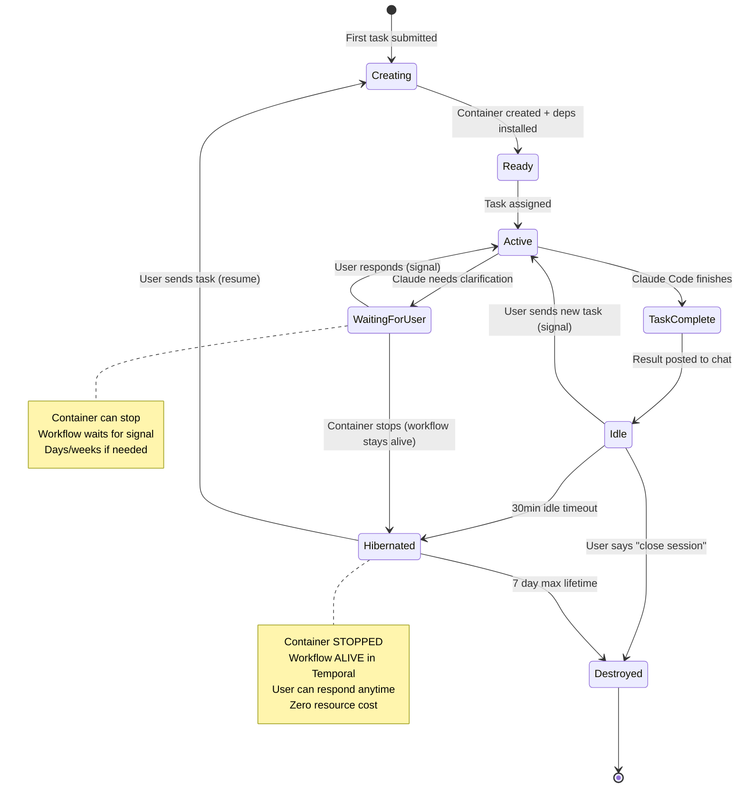
```mermaid
stateDiagram-v2
    [*] --> Creating: First task submitted

    Creating --> Ready: Container created + deps installed
    Ready --> Active: Task assigned

    Active --> TaskComplete: Claude Code finishes
    TaskComplete --> Idle: Result posted to chat

    Idle --> Active: User sends new task (signal)
    Idle --> Hibernated: 30min idle timeout

    Hibernated --> Creating: User sends task (resume)
    
    Active --> WaitingForUser: Claude needs clarification
    WaitingForUser --> Active: User responds (signal)
    WaitingForUser --> Hibernated: Container stops (workflow stays alive)
    
    Idle --> Destroyed: User says "close session"
    Hibernated --> Destroyed: 7 day max lifetime
    Destroyed --> [*]

    note right of Hibernated
        Container STOPPED
        Workflow ALIVE in Temporal
        User can respond anytime
        Zero resource cost
    end note

    note right of WaitingForUser
        Container can stop
        Workflow waits for signal
        Days/weeks if needed
    end note
```

### Orchestrator Routing Decision Tree

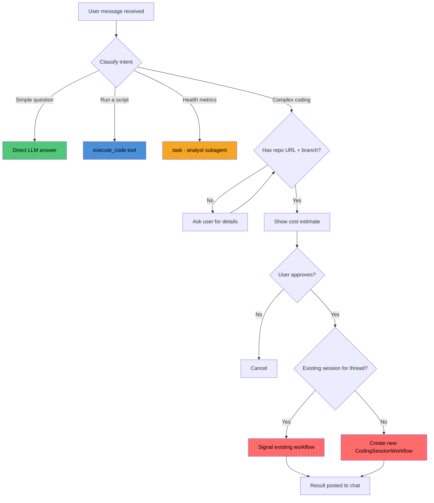
```mermaid
flowchart TD
    classDef direct fill:#50C878,color:#000000
    classDef code fill:#4A90D9,color:#000000
    classDef subagent fill:#F5A623,color:#000000
    classDef claude fill:#FF6B6B,color:#000000

    START[User message received] --> CLASSIFY{Classify intent}

    CLASSIFY -->|Simple question| DIRECT[Direct LLM answer]:::direct
    CLASSIFY -->|Run a script| CODE[execute_code tool]:::code
    CLASSIFY -->|Health metrics| SUBAGENT[task - analyst subagent]:::subagent
    CLASSIFY -->|Complex coding| CLAUDE_CHECK{Has repo URL + branch?}

    CLAUDE_CHECK -->|No| ASK[Ask user for details]
    ASK --> CLAUDE_CHECK

    CLAUDE_CHECK -->|Yes| ESTIMATE[Show cost estimate]
    ESTIMATE --> APPROVE{User approves?}

    APPROVE -->|No| CANCEL[Cancel]
    APPROVE -->|Yes| SESSION_CHECK{Existing session for thread?}

    SESSION_CHECK -->|Yes| SIGNAL[Signal existing workflow]:::claude
    SESSION_CHECK -->|No| CREATE[Create new CodingSessionWorkflow]:::claude

    SIGNAL --> RESULT[Result posted to chat]
    CREATE --> RESULT

    class DIRECT direct
    class CODE code
    class SUBAGENT subagent
    class SIGNAL,CREATE claude
```

### Container Architecture (Local vs Production)

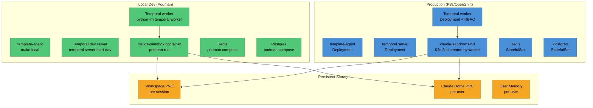
```mermaid
graph TB
    classDef local fill:#50C878,stroke:#3AA05E,color:#000000
    classDef prod fill:#4A90D9,stroke:#2C5F8A,color:#000000
    classDef shared fill:#F5A623,stroke:#D4891A,color:#000000

    subgraph LOCAL["Local Dev (Podman)"]
        L1[template-agent<br/>make local]:::local
        L2[Temporal dev server<br/>temporal server start-dev]:::local
        L3[Temporal worker<br/>python -m temporal.worker]:::local
        L4[claude-sandbox container<br/>podman run]:::local
        L5[Redis<br/>podman compose]:::local
        L6[Postgres<br/>podman compose]:::local
    end

    subgraph PROD["Production (K8s/OpenShift)"]
        P1[template-agent<br/>Deployment]:::prod
        P2[Temporal server<br/>Deployment]:::prod
        P3[Temporal worker<br/>Deployment + RBAC]:::prod
        P4[claude-sandbox Pod<br/>K8s Job created by worker]:::prod
        P5[Redis<br/>StatefulSet]:::prod
        P6[Postgres<br/>StatefulSet]:::prod
    end

    subgraph STORAGE["Persistent Storage"]
        S1[Workspace PVC<br/>per session]:::shared
        S2[Claude Home PVC<br/>per user]:::shared
        S3[User Memory<br/>per user]:::shared
    end

    L4 --> S1
    L4 --> S2
    P4 --> S1
    P4 --> S2
    L3 --> L4
    P3 --> P4

    class L1,L2,L3,L4,L5,L6 local
    class P1,P2,P3,P4,P5,P6 prod
    class S1,S2,S3 shared
```

### Production Deployment (K8s)

```
4 components:
  1. template-agent (Aegra) — Deployment, always-on
  2. temporal-server — Deployment, always-on  
  3. temporal-worker — Deployment, always-on, has K8s RBAC
  4. claude-sandbox — Pod (created by worker), ephemeral

Storage:
  - PVC per session: workspace code + .claude directory
  - PVC per user: ~/.claude-homes/{user_id}/ (sessions, plugins, settings)
  - Redis: workflow store, pub/sub notifications
  - Postgres: Temporal state, LangGraph checkpoints
```

## Testing Plan

1. **Unit tests:** Config validation, command building, result parsing, cost calculation, test-result detection (three-signal contract), middleware ordering validation
2. **Integration test (Podman):** End-to-end `claude -p` in Podman, verify JSON parsing
3. **Integration test (K8s):** Job manifest generation, `activeDeadlineSeconds` set, NetworkPolicy created, cleanup verified
4. **Loop engineering test:** Simulate failures (exit code, is_error, output patterns), verify error context passed correctly, verify session reuse cap
5. **Cost governance test:** Verify loop aborts when `max_cost_usd_per_loop` exceeded, verify per-invocation cap
6. **HITL test:** Verify `interrupt()` is called at checkpoints, verify resume with user feedback works
7. **Concurrency test:** Verify per-org semaphore blocks when limit reached, verify queue timeout rejection
8. **Audit test:** Verify audit events emitted for every iteration and checkpoint
9. **Security test:** Verify `allow_internet` is not accepted in config, verify credentials not mounted with loose network policy
