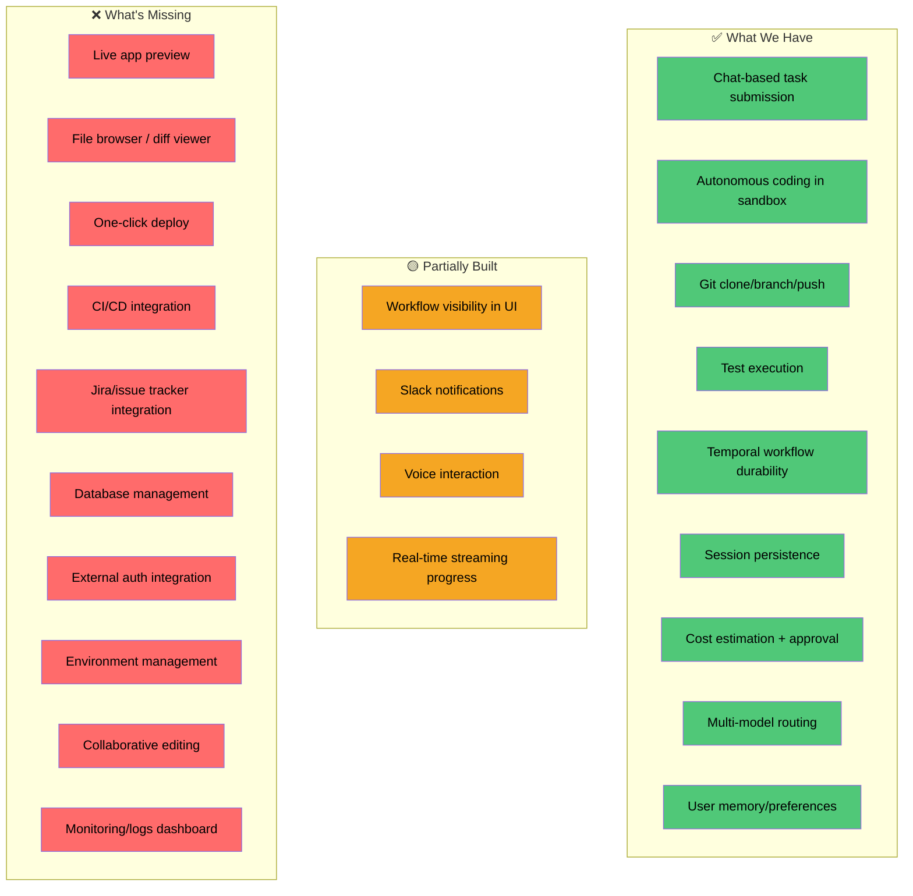

# Loop Engineering — Market Analysis & Full SDLC Vision

## How AI App Builders Work Today

### Tier 1: AI App Generators (Bolt, Lovable, v0)

```
USER: "Build a task management app with auth"
  ↓
AI generates full stack in seconds
  ↓
Live preview in browser (WebContainer / iframe)
  ↓
User iterates via chat: "add a dark mode toggle"
  ↓
One-click deploy to Vercel/Netlify
```

**What they do well:**
- Zero setup → working app in 60 seconds
- Live preview (code → UI instantly)
- One-click deploy
- Supabase/Firebase integration for auth + DB

**What they DON'T do:**
- Enterprise codebases (can't work on existing repos)
- Complex backend logic (microservices, queues, etc.)
- CI/CD, code review, testing pipelines
- Team collaboration with SDLC processes
- External system integration (CRM, ERP, data warehouses)

### Tier 2: AI-Powered IDEs (Cursor, Windsurf, Copilot)

```
Developer opens project in IDE
  ↓
AI suggests code, answers questions, refactors
  ↓
Developer reviews, edits, runs locally
  ↓
Developer pushes to git, creates PR
```

**What they do well:**
- Works on ANY existing codebase
- Deep context understanding
- Developer stays in control
- Full IDE features (debugging, terminal, extensions)

**What they DON'T do:**
- Autonomous execution (always needs human in the loop)
- SDLC orchestration (just coding assistance)
- Deployment, CI/CD, project management
- Accessible to non-developers (PMs, business users)

### Tier 3: Full SDLC Platforms (GitHub Copilot Workspace, Devin)

```
PM creates an issue: "Add pagination to the user list"
  ↓
AI reads codebase, creates implementation plan
  ↓
AI writes code, tests, creates PR
  ↓
Human reviews and merges
  ↓
CI/CD deploys automatically
```

**What they do well:**
- Issue → PR (end-to-end)
- Codebase-aware planning
- Test-driven implementation
- Integrates with existing dev workflow

**What they DON'T do:**
- Multi-step projects (just single issues)
- Business user access (still developer-focused)
- Live preview / deployment management
- External integrations beyond git

## Where Loop Engineering Fits

Loop Engineering is positioned between Tier 2 and Tier 3 — it works on **existing enterprise codebases** (unlike Bolt/Lovable) with **autonomous execution** (unlike Cursor) and **full SDLC process** (unlike Copilot Workspace).

```
                    Accessibility
                    (non-dev users)
                         ↑
                         │
         Bolt/Lovable ●  │
                         │
                         │           ● Loop Engineering
                         │             (target position)
                         │
                         │  ● Copilot Workspace
                         │
         Cursor/Windsurf │●
                         └────────────────────────→ Enterprise
                                                    Capability
                                                    (existing codebases,
                                                     SDLC, integrations)
```

## What Loop Engineering Needs to Be a Full Platform

### The Developer's Complete Workflow (on their laptop)

```
1. REQUIREMENTS    Jira ticket / Slack message / email
2. EXPLORE         Open IDE, read code, understand context
3. PLAN            Design approach, discuss with team
4. CODE            Write implementation
5. TEST            Run tests locally, fix failures
6. PREVIEW         Run app locally, check UI
7. REVIEW          Create PR, get code review
8. CI/CD           Pipeline runs, builds, deploys to staging
9. DEPLOY          Promote to production
10. MONITOR        Check logs, metrics, alerts
11. ITERATE        Bug reports → back to step 1
```

### How Loop Engineering Maps to Each Step

| Step | Local Developer | Loop Engineering Today | What's Needed |
|------|----------------|----------------------|---------------|
| **1. Requirements** | Reads Jira/Slack | User types in chat ✅ | Jira integration → auto-create tasks from tickets |
| **2. Explore** | Opens IDE, grep, git log | Claude Code reads codebase ✅ | File browser in UI, codebase visualization |
| **3. Plan** | Discusses with team | Agent shows plan + cost ✅ | Collaborative planning (multiple users), architecture diagrams |
| **4. Code** | Writes in IDE | Claude Code writes in sandbox ✅ | Live file diff view in UI, real-time code streaming |
| **5. Test** | `pytest`, `npm test` | Claude Code runs tests ✅ | Test results panel in UI, coverage report |
| **6. Preview** | `npm run dev`, opens browser | ❌ Not supported | **Live preview** — run the app in sandbox, expose port, show in iframe |
| **7. Review** | `git push`, create PR | Claude Code pushes ✅ | PR creation from UI, code review agent, diff viewer |
| **8. CI/CD** | GitHub Actions / GitLab CI | ❌ Not supported | Trigger CI pipeline, show results in UI |
| **9. Deploy** | `kubectl apply` / Helm | ❌ Not supported | One-click deploy to staging/prod (OpenShift, EKS) |
| **10. Monitor** | Grafana, logs | ❌ Not supported | Integrate monitoring dashboards, log viewer |
| **11. Iterate** | Read bug report, fix | Bug hunter works ✅ | Auto-detect regressions, suggest fixes |

### Critical Gaps to Fill



## How to Build Each Missing Piece

### 1. Live App Preview (Highest Impact)

This is what makes Bolt/Lovable magical — you see the app running instantly.

```
How it works in Bolt:
  AI writes code → WebContainer runs it → iframe shows the app

How it could work in Loop Engineering:
  Claude Code writes code in sandbox
  → Sandbox runs the app (uvicorn, npm start)
  → Port forwarded to user's browser
  → User sees live preview in the chat UI
```

**Implementation:**
```
Sandbox container:
  - Claude Code writes the app
  - Starts the app server inside the container
  - Exposes port (e.g., 8000)
  
Worker:
  - Detects running app server in container
  - Creates port-forward: container:8000 → host:random_port
  - Sends preview URL to chat

UI:
  - Renders iframe with the preview URL
  - Or opens in new tab
```

In K8s production:
```yaml
apiVersion: v1
kind: Service
metadata:
  name: preview-{session-id}
spec:
  selector:
    app: claude-session-{session-id}
  ports:
  - port: 8000
    targetPort: 8000
  type: ClusterIP  # + Ingress for external access
```

### 2. File Browser / Diff Viewer

Like VS Code's explorer but in the chat UI:

```
┌─────────────────────────────────────────────────────┐
│  📁 Project Files (live from sandbox)               │
│                                                      │
│  📁 todo_app/                                        │
│  ├── 📄 __init__.py                                  │
│  ├── 📄 models.py         ← click to view           │
│  ├── 📄 main.py           ← modified (diff)         │
│  └── 📁 templates/                                   │
│      └── 📄 index.html                               │
│  📁 tests/                                           │
│  └── 📄 test_api.py       ← 34 tests passing        │
│  📄 pyproject.toml                                   │
│  📄 CLAUDE.md                                        │
└─────────────────────────────────────────────────────┘
```

**Implementation:**
- API endpoint: `GET /api/sandbox/{session}/files` → lists workspace files
- API endpoint: `GET /api/sandbox/{session}/file/{path}` → returns file content
- API endpoint: `GET /api/sandbox/{session}/diff` → returns git diff
- UI component: FileExplorer with syntax highlighting

### 3. One-Click Deploy

```
User: "Deploy this to staging"
Agent: Deploys via Helm/kubectl/ArgoCD

Steps:
  1. Claude Code builds container image (Dockerfile in repo)
  2. Pushes to container registry (Quay, ECR)
  3. Applies K8s manifests / Helm chart
  4. Reports deployment URL
```

### 4. Jira Integration

```
Jira webhook → triggers task in chat:
  "PROJ-123: Add pagination to user list API"
  
Agent:
  1. Reads Jira ticket description + acceptance criteria
  2. Clones repo, creates branch feat/PROJ-123
  3. Implements feature, writes tests
  4. Creates PR, links to Jira ticket
  5. Transitions ticket to "In Review"
  6. Notifies assignee on Slack
```

**Already partially built:** template-agent has Jira MCP integration via the `mcp-atlassian` plugin.

### 5. External System Integration

For enterprise users connecting to auth, databases, APIs:

```
User: "Connect to our Salesforce CRM and build a dashboard"

Agent:
  1. Asks for Salesforce OAuth credentials (stored securely)
  2. Sets up MCP server for Salesforce API
  3. Claude Code queries Salesforce data
  4. Builds dashboard with charts
  5. Deploys to internal URL
```

**MCP (Model Context Protocol) is the bridge:**
- Each external system = an MCP server
- Claude Code connects via `.mcp.json` config
- Data flows through MCP, not direct API calls
- Security: MCP server handles auth, rate limits, permissions

### 6. Database Management

```
User: "Set up a Postgres database for the TODO app"

Agent:
  1. Provisions database (CloudNativePG / RDS)
  2. Creates schema from SQLAlchemy models
  3. Generates migrations (Alembic)
  4. Seeds with test data
  5. Provides connection string to the app
```

## Competitive Landscape

| Feature | Bolt | Lovable | Cursor | Copilot WS | Devin | **Loop Eng** |
|---------|------|---------|--------|-----------|-------|-------------|
| Natural language → code | ✅ | ✅ | ✅ | ✅ | ✅ | ✅ |
| Live preview | ✅ | ✅ | ❌ | ❌ | ✅ | ❌ → planned |
| Existing codebase | ❌ | ❌ | ✅ | ✅ | ✅ | ✅ |
| Git integration | ❌ | ❌ | ✅ | ✅ | ✅ | ✅ |
| Test execution | ❌ | ❌ | ❌ | ❌ | ✅ | ✅ |
| Enterprise auth | ❌ | ❌ | ❌ | ❌ | ❌ | ✅ (SSO) |
| Durable workflows | ❌ | ❌ | ❌ | ❌ | ❌ | ✅ (Temporal) |
| Cost governance | ❌ | ❌ | ❌ | ❌ | ❌ | ✅ |
| Session persistence | ✅ | ✅ | ✅ | ❌ | ✅ | ✅ |
| Slack notifications | ❌ | ❌ | ❌ | ❌ | ✅ | ✅ |
| One-click deploy | ✅ | ✅ | ❌ | ❌ | ❌ | ❌ → planned |
| Jira integration | ❌ | ❌ | ❌ | ❌ | ❌ | ❌ → planned |
| Multi-user collab | ❌ | ✅ | ❌ | ❌ | ❌ | ❌ → planned |
| Self-hosted | ❌ | ❌ | ❌ | ❌ | ❌ | ✅ |
| K8s native | ❌ | ❌ | ❌ | ❌ | ❌ | ✅ |

## Loop Engineering's Unique Advantages

1. **Enterprise-first**: SSO, RBAC, audit trails, self-hosted — none of the competitors offer this
2. **Existing codebases**: Works on your real repos, not just greenfield projects
3. **Durable workflows**: Temporal ensures no work is lost — competitors crash and you start over
4. **Cost governance**: Budget caps, per-task estimation — enterprises need this
5. **K8s native**: Runs where your infrastructure runs — same cluster, same security
6. **Extensible**: MCP for any integration, plugins for any capability

## Roadmap Priority

```
NOW (Phase 1-4 — done):
  ✅ Sandbox execution via Temporal
  ✅ Session persistence
  ✅ Git integration
  ✅ Cost estimation
  ✅ Chat UI with workflows

NEXT (Phase 5 — highest impact):
  → Live app preview in UI (iframe/port-forward)
  → File browser / diff viewer
  → PR creation from UI

THEN (Phase 6 — enterprise features):
  → Jira integration (ticket → PR)
  → CI/CD pipeline trigger
  → One-click deploy to staging

LATER (Phase 7 — full platform):
  → Database provisioning
  → External system integration (MCP)
  → Monitoring dashboard
  → Multi-user collaboration
```
